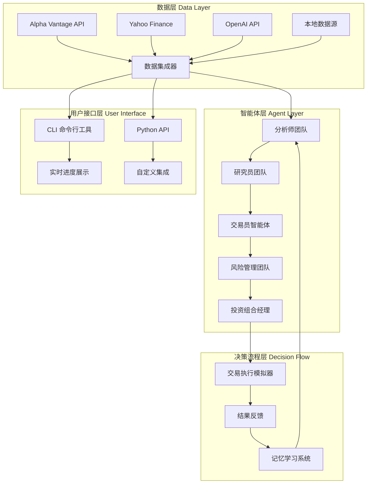
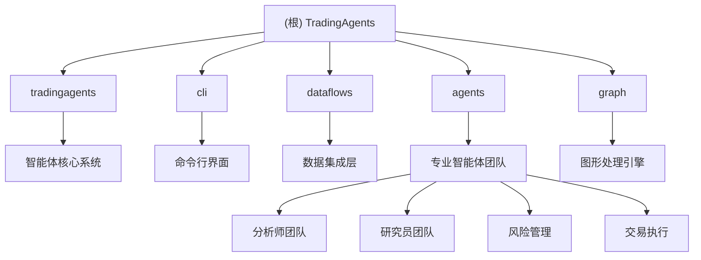

# TradingAgents: AI 智能交易代理系统

## 项目愿景与目标

TradingAgents 是一个基于多智能体协作的 AI 驱动智能交易系统，旨在模拟真实交易公司的决策流程，通过专业化 LLM 驱动的智能体团队进行市场分析、风险评估和交易决策。

### 核心愿景
- **智能化决策**：利用 AI 技术实现金融市场的自动化分析与决策
- **多智能体协作**：模拟专业交易团队的分工协作模式
- **风险可控**：内置多层次风险管理机制，确保交易决策的稳健性
- **可扩展架构**：模块化设计支持灵活定制和功能扩展

### 技术特色
- 基于 LangGraph 的灵活框架
- 支持多种 LLM 模型（OpenAI、Anthropic、Google）
- 多数据源集成（Alpha Vantage、Yahoo Finance、OpenAI）
- 实时 CLI 界面展示决策过程

## 技术架构总览



### 核心架构组件

#### 1. 多智能体协作系统
- **分析师团队**：基本面、技术面、新闻、情感分析师
- **研究员团队**：看多/看空研究员进行辩论式分析
- **风险管理团队**：保守、激进、中性风险管理师
- **交易决策层**：交易员和投资组合经理

#### 2. 数据流处理
- 实时股票价格与技术指标数据
- 基本面财务数据获取
- 新闻舆情与社交媒体情感分析
- 宏观经济数据集成

#### 3. 图形处理引擎
基于 LangGraph 的状态机管理：
- 条件逻辑判断
- 信号传播处理
- 反思学习机制
- 动态路由控制

## 核心模块索引

| 模块路径 | 职责描述 | 关键文件 | 入口点 |
|---------|---------|---------|--------|
| [tradingagents/agents](./tradingagents/agents/) | 智能体核心实现 | agent_states.py, agent_utils.py | 智能体状态管理 |
| [tradingagents/agents/analysts](./tradingagents/agents/analysts/) | 专业分析师团队 | fundamentals_analyst.py, news_analyst.py | 市场分析入口 |
| [tradingagents/agents/researchers](./tradingagents/agents/researchers/) | 研究员辩论团队 | bull_researcher.py, bear_researcher.py | 深度研究分析 |
| [tradingagents/agents/risk_mgmt](./tradingagents/agents/risk_mgmt/) | 风险管理团队 | conservative_debator.py, aggresive_debator.py | 风险评估 |
| [tradingagents/agents/trader](./tradingagents/agents/trader/) | 交易决策执行 | trader.py | 最终交易决策 |
| [tradingagents/dataflows](./tradingagents/dataflows/) | 数据供应商集成 | alpha_vantage.py, y_finance.py | 数据获取接口 |
| [tradingagents/graph](./tradingagents/graph/) | 图形处理引擎 | trading_graph.py, conditional_logic.py | 决策流程控制 |
| [cli](./cli/) | 命令行界面 | main.py, models.py | 用户交互入口 |

### 智能体详细架构



## 运行与开发

### 环境要求
- Python 3.10+
- OpenAI API Key
- Alpha Vantage API Key（推荐）

### 快速启动

1. **安装依赖**
```bash
git clone https://github.com/TauricResearch/TradingAgents.git
cd TradingAgents
pip install -r requirements.txt
```

2. **配置环境变量**
```bash
export OPENAI_API_KEY=$YOUR_OPENAI_API_KEY
export ALPHA_VANTAGE_API_KEY=$YOUR_ALPHA_VANTAGE_API_KEY
```

3. **运行 CLI 工具**
```bash
python -m cli.main
```

4. **Python API 使用**
```python
from tradingagents.graph.trading_graph import TradingAgentsGraph
from tradingagents.default_config import DEFAULT_CONFIG

ta = TradingAgentsGraph(debug=True, config=DEFAULT_CONFIG.copy())
_, decision = ta.propagate("NVDA", "2024-05-10")
print(decision)
```

### 开发模式配置
```python
config = DEFAULT_CONFIG.copy()
config["deep_think_llm"] = "gpt-4o-mini"  # 节省成本
config["quick_think_llm"] = "gpt-4o-mini"
config["max_debate_rounds"] = 1  # 减少辩论轮次
```

## 测试策略

### 测试框架
- 单元测试：每个智能体的独立功能测试
- 集成测试：多智能体协作流程测试
- 回测验证：历史数据验证交易决策效果
- 性能测试：API 调用效率和响应时间

### 测试数据
- 本地测试数据集（Tauric TradingDB）
- 模拟市场环境
- A/B 测试不同配置的效果

### 质量保证
- 代码覆盖率监控
- 智能体输出一致性检查
- 风险管理机制验证
- 决策流程可解释性测试

## 编码规范

### Python 编码标准
- 遵循 PEP 8 代码风格
- 使用类型注解提高代码可读性
- 文档字符串遵循 Google 风格
- 单一职责原则设计函数和类

### 智能体开发规范
- **状态管理**：使用 AgentState 统一状态模式
- **工具接口**：通过 agent_utils 抽象数据获取
- **错误处理**：优雅的异常处理和降级策略
- **配置管理**：通过 default_config 统一配置

### 数据处理流程
- **缓存策略**：本地缓存减少 API 调用
- **数据验证**：输入数据格式和完整性检查
- **异步处理**：并发数据获取提高效率
- **错误恢复**：数据获取失败的重试机制

### 通信协议
- **消息格式**：结构化的智能体间通信
- **状态同步**：可靠的状态传递机制
- **超时控制**：防止智能体死锁
- **日志记录**：完整的决策过程追踪

## AI 使用指引

### 模型选择策略
- **深度思考**：o1-preview/gpt-4o 用于复杂分析
- **快速响应**：gpt-4o-mini 用于测试开发
- **成本控制**：根据任务复杂度动态选择模型
- **质量平衡**：在分析质量和响应速度间找平衡

### 提示工程最佳实践
- **角色设定**：明确的智能体角色和职责
- **上下文管理**：有效的上下文长度控制
- **输出格式**：结构化的输出格式规范
- **一致性保证**：相同输入的稳定输出

### 决策优化
- **多模型集成**：不同模型观点的集成
- **置信度评估**：决策置信度的量化评估
- **反馈学习**：基于结果反馈的模型优化
- **人类监督**：关键决策的人工审核机制

## 变更记录 (Changelog)

### 2024-12-20 - 初始版本
- 创建根级 CLAUDE.md 文档
- 完成项目架构分析和模块索引
- 建立 Mermaid 架构图和依赖关系图
- 定义开发规范和 AI 使用指引

### 下一步计划
- [ ] 创建模块级 CLAUDE.md 文档
- [ ] 完善 .claude/index.json 扫描记录
- [ ] 增加代码覆盖率报告
- [ ] 建立持续集成测试流程

---

**免责声明**：TradingAgents 框架设计用于研究目的。交易表现可能因多种因素而异，包括所选的语言模型、模型温度、交易周期、数据质量和其他非确定性因素。本框架不构成财务、投资或交易建议。

更多信息请访问 [Tauric Research](https://tauric.ai/) 或加入我们的 [Discord 社区](https://discord.com/invite/hk9PGKShPK)。