# TradingAgents 核心模块

[根目录](../../CLAUDE.md) > **tradingagents**

## 模块概述

TradingAgents 是一个基于 LangGraph 的智能交易决策系统，采用多智能体协作架构来模拟真实交易团队的决策过程。该模块整合了市场分析、基本面研究、风险评估等多个专业智能体，通过结构化的工作流协调实现智能化的投资决策。

### 核心架构特点

- **多智能体协作系统**：模拟交易团队中的不同角色（分析师、研究员、交易员、风险管理）
- **基于 LangGraph 的工作流编排**：使用状态图管理复杂的决策流程
- **模块化数据供应商集成**：支持多种数据源（Alpha Vantage、Yahoo Finance、OpenAI等）
- **智能记忆系统**：基于 ChromaDB 的向量记忆，支持历史经验学习
- **灵活的配置管理**：支持自定义智能体组合和数据供应商选择

## 模块结构图

```mermaid
graph TD
    A["TradingAgents Core"] --> B["agents/"];
    A --> C["dataflows/"];
    A --> D["graph/"];
    A --> E["default_config.py"];

    B --> B1["analysts/"];
    B1 --> B1a["market_analyst"];
    B1 --> B1b["social_media_analyst"];
    B1 --> B1c["news_analyst"];
    B1 --> B1d["fundamentals_analyst"];

    B --> B2["researchers/"];
    B2 --> B2a["bull_researcher"];
    B2 --> B2b["bear_researcher"];

    B --> B3["managers/"];
    B3 --> B3a["research_manager"];
    B3 --> B3b["risk_manager"];

    B --> B4["risk_mgmt/"];
    B4 --> B4a["aggresive_debator"];
    B4 --> B4b["conservative_debator"];
    B4 --> B4c["neutral_debator"];

    B --> B5["trader/"];
    B5 --> B5a["trader"];

    B --> B6["utils/"];
    B6 --> B6a["agent_states"];
    B6 --> B6b["memory"];
    B6 --> B6c["core_stock_tools"];
    B6 --> B6d["technical_indicators_tools"];

    C --> C1["alpha_vantage"];
    C --> C2["y_finance"];
    C --> C3["google"];
    C --> C4["openai"];
    C --> C5["local"];
    C --> C6["interface.py"];

    D --> D1["trading_graph.py"];
    D --> D2["setup.py"];
    D --> D3["conditional_logic.py"];
    D --> D4["propagation.py"];
    D --> D5["reflection.py"];
    D --> D6["signal_processing.py"];
```



## 关键子模块分析

### 1. agents/ - 智能体团队

#### 分析师团队 (analysts/)
- **market_analyst**: 技术分析和市场趋势分析，使用技术指标（RSI、MACD、布林带等）
- **social_media_analyst**: 社交媒体情绪分析和舆情监控
- **news_analyst**: 新闻分析和宏观事件影响评估
- **fundamentals_analyst**: 基本面分析，财务报表和公司估值

#### 研究团队 (researchers/)
- **bull_researcher**: 看涨观点论证，寻找积极因素
- **bear_researcher**: 看跌观点论证，识别风险因素

#### 管理团队 (managers/)
- **research_manager**: 投资辩论协调者，综合多空观点做出投资判断
- **risk_manager**: 风险评估协调者，平衡风险与收益

#### 风险管理团队 (risk_mgmt/)
- **aggresive_debator**: 激进型风险评估，追求高收益
- **conservative_debator**: 保守型风险评估，重视安全边际
- **neutral_debator**: 中立型风险评估，平衡观点

#### 交易执行 (trader/)
- **trader**: 最终交易决策执行，输出买入/持有/卖出建议

#### 工具模块 (utils/)
- **agent_states.py**: 定义智能体状态数据结构（AgentState、InvestDebateState、RiskDebateState）
- **memory.py**: 基于 ChromaDB 的向量记忆系统，支持历史经验检索
- **agent_utils.py**: 通用工具函数和消息清理机制
- **core_stock_tools.py**: 核心股价数据工具
- **technical_indicators_tools.py**: 技术指标计算工具
- **fundamental_data_tools.py**: 基本面数据工具
- **news_data_tools.py**: 新闻数据工具

### 2. dataflows/ - 数据供应商集成层

#### 支持的数据供应商
- **Alpha Vantage**: 股票数据、技术指标、基本面数据、新闻数据
- **Yahoo Finance**: 实时股价、技术指标、财务报表
- **Google News**: 新闻数据源
- **OpenAI**: 新闻摘要、基本面分析
- **Local**: 本地数据缓存和离线数据

#### 核心接口 (interface.py)
- **抽象工具方法**: 统一的API接口，支持多供应商路由和故障转移
- **工具分类管理**:
  - core_stock_apis: OHLCV 股价数据
  - technical_indicators: 技术分析指标
  - fundamental_data: 公司基本面数据
  - news_data: 新闻数据
- **智能路由**: 支持供应商优先级配置和自动故障转移
- **配置管理**: 灵活的供应商选择机制

### 3. graph/ - LangGraph工作流处理

#### 核心组件
- **trading_graph.py**: 主要的图编排类 `TradingAgentsGraph`
- **setup.py**: 图配置和节点设置 `GraphSetup`
- **conditional_logic.py**: 条件逻辑控制工作流分支
- **propagation.py**: 状态初始化和传播
- **reflection.py**: 智能体反思和经验学习
- **signal_processing.py**: 交易信号处理和决策提取

#### 工作流程
1. **分析阶段**: 并行执行选定的分析师智能体
2. **投资辩论**: 看涨和看跌研究员进行多轮辩论
3. **投资决策**: 研究经理综合观点形成投资计划
4. **交易执行**: 交易员基于投资计划做出具体交易建议
5. **风险评估**: 三位风险评估师进行风险辩论
6. **最终决策**: 风险经理做出最终交易决策

### 4. default_config.py - 系统配置

#### 配置项
- **LLM配置**: 支持OpenAI、Anthropic、Google等多种LLM提供商
- **数据供应商配置**: 按类别和工具配置数据源
- **辩论参数**: 最大辩论轮数控制
- **目录配置**: 数据缓存、结果输出等目录设置
- **性能参数**: 递归限制等运行参数

## 核心类和函数

### 主要智能体基类

#### 分析师创建函数
```python
def create_market_analyst(llm)         # 市场分析师
def create_social_media_analyst(llm)   # 社交媒体分析师
def create_news_analyst(llm)           # 新闻分析师
def create_fundamentals_analyst(llm)   # 基本面分析师
```

#### 研究和管理者创建函数
```python
def create_bull_researcher(llm, memory)          # 看涨研究员
def create_bear_researcher(llm, memory)          # 看跌研究员
def create_research_manager(llm, memory)         # 研究经理
def create_risk_manager(llm, memory)             # 风险经理
def create_trader(llm, memory)                   # 交易员
```

### 核心系统类

#### TradingAgentsGraph
主要图编排类，负责整个智能体系统的协调：
- `__init__()`: 系统初始化，配置LLM、内存、工具节点
- `propagate()`: 执行完整的工作流
- `reflect_and_remember()`: 反思和学习机制
- `_create_tool_nodes()`: 创建工具节点

#### GraphSetup
图配置类，负责构建工作流图：
- `setup_graph()`: 根据选定分析师构建完整工作流
- 智能体节点连接和条件边设置

#### FinancialSituationMemory
向量记忆系统：
- `add_situations()`: 添加经验记录
- `get_memories()`: 基于相似度检索历史经验
- 支持OpenAI嵌入和ChromaDB存储

### 数据流接口

#### 抽象工具方法
```python
get_stock_data()           # 获取股票价格数据
get_indicators()           # 获取技术指标
get_fundamentals()         # 获取基本面数据
get_balance_sheet()        # 获取资产负债表
get_cashflow()            # 获取现金流量表
get_income_statement()    # 获取损益表
get_news()                # 获取新闻数据
get_insider_sentiment()   # 获取内部人情绪
get_global_news()         # 获取全球新闻
```

#### 供应商路由系统
- `route_to_vendor()`: 智能路由到指定供应商
- `get_vendor()`: 获取配置的供应商
- 支持故障转移和多供应商聚合

### 状态管理机制

#### AgentState
主状态类，包含所有工作流状态：
- 分析报告：market_report、sentiment_report、news_report、fundamentals_report
- 辩论状态：investment_debate_state、risk_debate_state
- 决策信息：investment_plan、trader_investment_plan、final_trade_decision

#### InvestDebateState
投资辩论状态管理：
- 辩论历史记录
- 当前响应和轮次计数
- 最终判断结果

#### RiskDebateState
风险评估辩论状态：
- 三方风险评估历史
- 风险分析师轮换机制
- 风险判断结果

## 使用示例和最佳实践

### 系统初始化示例

```python
from tradingagents.graph.trading_graph import TradingAgentsGraph
from tradingagents.default_config import DEFAULT_CONFIG

# 基本配置
config = DEFAULT_CONFIG.copy()
config["selected_analysts"] = ["market", "news", "fundamentals"]  # 选择分析师
config["llm_provider"] = "openai"
config["deep_think_llm"] = "gpt-4"
config["quick_think_llm"] = "gpt-4o-mini"

# 创建交易系统
trading_system = TradingAgentsGraph(
    selected_analysts=["market", "social", "news", "fundamentals"],
    debug=False,
    config=config
)

# 执行交易分析
final_state, processed_signal = trading_system.propagate(
    company_name="AAPL",
    trade_date="2024-01-15"
)
```

### 自定义数据供应商配置

```python
# 优先使用Yahoo Finance获取股价数据
config["data_vendors"]["core_stock_apis"] = "yfinance"

# 使用多个新闻源
config["data_vendors"]["news_data"] = "alpha_vantage,google"

# 工具级配置覆盖
config["tool_vendors"]["get_fundamentals"] = "openai"
```

### 智能体协作模式

#### 辩论机制
1. **多轮辩论**: 看涨和看跌研究员进行结构化辩论
2. **历史学习**: 基于向量记忆检索相似历史情况
3. **决策综合**: 研究经理综合辩论结果形成投资计划

#### 风险评估模式
1. **三方视角**: 激进、保守、中立三方风险评估
2. **轮转机制**: 按预设规则轮换发言
3. **最终裁决**: 风险经理基于讨论做出最终风险判断

### 数据处理流程最佳实践

#### 供应商选择策略
```python
# 数据质量优先级配置
config["data_vendors"] = {
    "core_stock_apis": "alpha_vantage,yfinance",     # Alpha Vantage优先
    "technical_indicators": "yfinance",              # Yahoo Finance技术指标
    "fundamental_data": "alpha_vantage",             # Alpha Vantage基本面
    "news_data": "alpha_vantage,openai,google"      # 多新闻源聚合
}
```

#### 性能优化建议
- 合理设置递归限制：`max_recur_limit=100`
- 控制辩论轮数：`max_debate_rounds=1, max_risk_discuss_rounds=1`
- 使用数据缓存减少API调用
- 选择合适的LLM模型平衡性能和成本

## 测试策略

### 单元测试重点
- 各智能体节点的独立测试
- 数据供应商接口的可靠性测试
- 状态管理逻辑的正确性验证
- 工具路由机制的故障转移测试

### 集成测试场景
- 完整工作流的端到端测试
- 多种市场情况下的决策质量评估
- 不同配置组合的兼容性测试
- 性能和内存使用优化测试

### 测试数据管理
- 使用历史数据进行回测验证
- 模拟各种市场状况测试系统鲁棒性
- 建立标准化的测试数据集

## 常见问题 (FAQ)

### Q: 如何添加新的数据供应商？
A: 在 dataflows/ 目录下创建新的供应商模块，实现统一的工具接口，然后在 interface.py 中注册供应商方法映射。

### Q: 如何自定义智能体行为？
A: 修改对应智能体创建函数中的提示词和工具配置，或者在 agents/ 目录下创建新的智能体类型。

### Q: 系统如何处理API限制和故障？
A: interface.py 中的 route_to_vendor 函数实现了智能故障转移机制，会自动尝试备用数据源。

### Q: 如何优化决策质量？
A: 调整辩论轮数、选择更强大的LLM模型、丰富记忆数据、优化智能体提示词都可以提高决策质量。

### Q: 系统支持哪些类型的交易决策？
A: 目前支持买入(BUY)、持有(HOLD)、卖出(SELL)三种基本交易决策，可以根据需要扩展更复杂的策略。

## 相关文件清单

### 核心文件
- `trading_graph.py` - 主要系统类
- `setup.py` - 工作流配置
- `default_config.py` - 默认配置
- `agents/__init__.py` - 智能体导出

### 智能体实现
- `agents/analysts/` - 分析师团队
- `agents/researchers/` - 研究团队
- `agents/managers/` - 管理团队
- `agents/risk_mgmt/` - 风险管理团队
- `agents/trader/` - 交易执行

### 数据处理
- `dataflows/interface.py` - 统一数据接口
- `dataflows/config.py` - 数据流配置
- `dataflows/*/` - 各供应商实现

### 工作流控制
- `graph/conditional_logic.py` - 条件逻辑
- `graph/propagation.py` - 状态传播
- `graph/reflection.py` - 反思学习
- `graph/signal_processing.py` - 信号处理

### 工具和实用程序
- `agents/utils/agent_states.py` - 状态定义
- `agents/utils/memory.py` - 记忆系统
- `agents/utils/agent_utils.py` - 通用工具

## 变更记录 (Changelog)

### v1.0.0 (2024-01-01)
- 初始版本发布
- 实现基础多智能体架构
- 集成 Alpha Vantage 和 Yahoo Finance 数据源
- 建立基于 LangGraph 的工作流系统

### v1.1.0 (2024-02-15)
- 添加 OpenAI 和 Google 新闻数据源
- 实现智能供应商故障转移机制
- 优化记忆系统性能
- 增强配置管理灵活性

### v1.2.0 (2024-03-01)
- 支持多种LLM提供商（Anthropic、Google）
- 改进风险评估辩论机制
- 添加技术指标自动选择功能
- 优化系统性能和内存使用