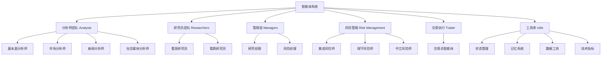
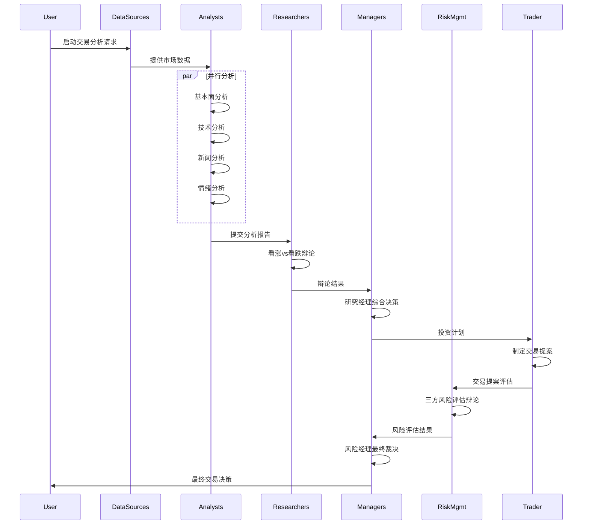
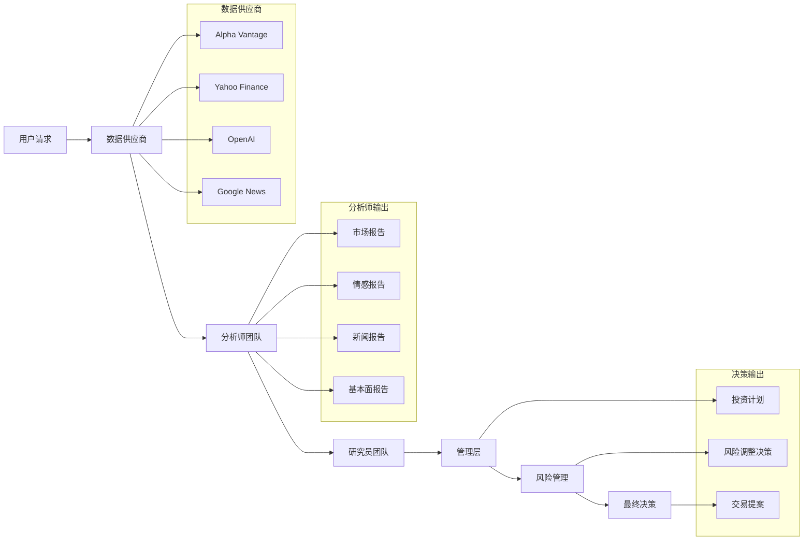

[根目录](../../../CLAUDE.md) > [tradingagents](../../CLAUDE.md) > **agents**

# TradingAgents 智能体系统

## 模块概述

Agents 模块是 TradingAgents 系统的核心智能体团队，采用专业化分工的多智能体协作架构来模拟真实交易公司的决策流程。系统通过分析师、研究员、风险管理和交易执行四个层级的智能体协作，实现了从市场分析到最终交易决策的完整智能化流程。

### 核心设计理念

- **专业化分工**：每个智能体专注于特定领域的分析和决策
- **协作式辩论**：通过多智能体辩论机制提高决策质量
- **经验学习**：基于向量记忆的历史经验检索和学习机制
- **分层决策**：从数据收集、分析、辩论到执行的分层决策流程

## 智能体架构总览



## 智能体协作流程



## 专业智能体团队分析

### 1. 分析师团队 (analysts/)

#### 核心职责
分析师团队负责从不同维度收集和分析市场数据，为后续决策提供全面的信息基础。

#### 专业分析师角色

**基本面分析师 (fundamentals_analyst.py)**
- **专业领域**：公司财务分析、估值模型、基本面指标
- **数据工具**：财务报表、基本面数据、内部人交易信息
- **分析方法**：财务比率分析、行业对比、盈利预测
- **输出内容**：详细的公司基本面分析报告，包含财务健康度评估

**市场分析师 (market_analyst.py)**
- **专业领域**：技术分析、市场趋势、价格行为
- **数据工具**：股价数据、技术指标（RSI、MACD、布林带、ATR等）
- **分析方法**：趋势分析、支撑阻力位、形态识别
- **输出内容**：技术分析报告，包含关键指标解读和趋势判断

**新闻分析师 (news_analyst.py)**
- **专业领域**：宏观经济新闻、市场事件、政策影响
- **数据工具**：全球新闻、公司新闻、宏观经济数据
- **分析方法**：新闻情感分析、事件影响评估、趋势关联
- **输出内容**：新闻分析报告，重点关注对交易决策有影响的信息

**社交媒体分析师 (social_media_analyst.py)**
- **专业领域**：社交媒体情绪、舆情监控、公众观点
- **数据工具**：社交媒体数据、情感分析工具
- **分析方法**：情感倾向分析、热度监测、观点挖掘
- **输出内容**：情绪分析报告，反映市场对公司或行业的整体情绪

### 2. 研究员团队 (researchers/)

#### 核心职责
研究员团队基于分析师的报告进行深度辩论，从看涨和看跌两个角度进行全面分析。

**看涨研究员 (bull_researcher.py)**
- **论证重点**：公司增长潜力、竞争优势、积极市场因素
- **辩论策略**：
  - 强调成长机会和市场前景
  - 突出公司核心竞争力和创新优势
  - 利用历史经验识别积极信号
  - 针对看跌观点提供数据驱动的反驳
- **学习能力**：基于记忆系统检索历史上的成功投资案例

**看跌研究员 (bear_researcher.py)**
- **论证重点**：风险因素、潜在问题、负面市场信号
- **辩论策略**：
  - 识别财务和市场风险
  - 分析竞争威胁和市场挑战
  - 基于历史经验警示类似情况
  - 针对看涨观点提出合理的质疑
- **风险意识**：通过记忆学习历史上的投资失败案例

### 3. 管理团队 (managers/)

#### 核心职责
管理层负责协调智能体间的辩论过程，综合不同观点做出最终判断。

**研究经理 (research_manager.py)**
- **角色定位**：投资辩论的协调者和最终裁决者
- **决策过程**：
  - 综合看涨和看跌研究员的辩论内容
  - 检索相关历史经验进行对比分析
  - 基于最有力证据做出明确的投资建议（买入/持有/卖出）
  - 为交易员制定详细的执行计划
- **避免中性偏误**：明确要求避免在没有充分理由时默认选择"持有"

**风险经理 (risk_manager.py)**
- **角色定位**：风险评估辩论的协调者和最终风险决策者
- **风险管理**：
  - 评估激进、保守、中立三种风险观点
  - 基于交易员的提案进行风险调整
  - 整合历史风险管理经验
  - 输出最终的风险调整后交易决策
- **平衡策略**：在风险和收益之间找到最优平衡点

### 4. 风险管理团队 (risk_mgmt/)

#### 核心职责
风险管理团队从不同风险偏好角度评估交易提案，提供多维度风险分析。

**激进风险分析师 (aggresive_debator.py)**
- **风险偏好**：高收益、高风险策略
- **分析重点**：
  - 识别高回报机会和增长潜力
  - 强调创新优势和竞争优势
  - 质疑保守观点可能错失的机会
  - 主张积极进取的投资策略
- **反驳策略**：针对保守观点提出数据驱动的反驳

**保守风险分析师 (conservative_debator.py)**
- **风险偏好**：低风险、稳定收益策略
- **分析重点**：
  - 识别潜在风险和威胁
  - 强调资产保护和稳定增长
  - 警示激进策略的潜在损失
  - 主张谨慎稳健的投资方法
- **风险控制**：重点关注下行风险和保护措施

**中立风险分析师 (neutral_debator.py)**
- **风险偏好**：平衡风险和收益的中性策略
- **分析重点**：
  - 平衡激进和保守观点
  - 寻找最优的风险调整收益
  - 考虑多元化投资策略
  - 主张理性平衡的投资方法
- **整合作用**：协调两种极端观点，寻找最佳平衡点

### 5. 交易执行 (trader/)

#### 核心职责
交易员基于研究经理的投资计划，制定具体的交易执行提案。

**交易员智能体 (trader.py)**
- **决策流程**：
  - 分析研究经理提供的投资计划
  - 结合市场分析、情绪、新闻和基本面报告
  - 检索历史交易经验进行对比
  - 输出明确的交易建议（买入/持有/卖出）
- **学习机制**：
  - 基于记忆系统的历史交易经验学习
  - 从成功和失败案例中提取教训
  - 避免重复历史错误
- **输出格式**：必须以"FINAL TRANSACTION PROPOSAL: **BUY/HOLD/SELL**"结束

### 6. 智能体工具库 (utils/)

#### 核心组件

**状态管理 (agent_states.py)**
- **AgentState**：主状态类，包含工作流中的所有状态信息
- **InvestDebateState**：投资辩论状态管理
- **RiskDebateState**：风险评估辩论状态
- **状态字段**：
  - 公司信息：company_of_interest, trade_date
  - 分析报告：market_report, sentiment_report, news_report, fundamentals_report
  - 决策信息：investment_plan, final_trade_decision

**记忆系统 (memory.py)**
- **FinancialSituationMemory**：基于 ChromaDB 的向量记忆系统
- **核心功能**：
  - 向量嵌入生成（支持 OpenAI 和本地模型）
  - 相似性搜索和记忆检索
  - 历史经验学习
- **学习机制**：
  - 存储历史决策情境和结果
  - 基于相似度检索相关经验
  - 为智能体提供历史教训参考

**数据工具 (core_stock_tools.py, fundamental_data_tools.py, news_data_tools.py, technical_indicators_tools.py)**
- **股票数据工具**：获取 OHLCV 股价数据
- **基本面数据工具**：财务报表、基本面指标获取
- **新闻数据工具**：新闻搜索、情感分析、内部人交易信息
- **技术指标工具**：各种技术分析指标计算

## 核心实现技术

### 智能体创建函数架构

所有智能体都采用统一的工厂函数模式：
```python
def create_[agent_name](llm, memory=None) -> Callable:
    def [agent_name]_node(state) -> dict:
        # 智能体逻辑实现
        # 处理输入状态
        # 调用LLM生成响应
        # 返回更新后的状态
    return [agent_name]_node
```

### 状态管理机制

#### 统一状态模式
- 使用 TypedDict 定义状态结构
- 状态在智能体间传递和更新
- 支持状态历史的维护和访问

#### 状态字段分类
- **分析报告字段**：存储各分析师的分析结果
- **辩论状态字段**：管理辩论过程和历史记录
- **决策结果字段**：存储各级别的决策结果
- **元数据字段**：公司信息、交易日期等基础信息

### 提示工程策略

#### 角色定义模式
每个智能体都有明确的角色定位和职责范围：
```python
system_message = (
    "You are a [Role] tasked with [Specific Responsibility]. "
    "Your focus is on [Key Areas] and you should [Expected Behaviors]."
)
```

#### 工具集成策略
- 通过 bind_tools 方法为 LLM 提供数据访问能力
- 支持函数调用和工具使用
- 错误处理和工具调用结果验证

#### 输出格式规范
- 要求智能体提供详细、具体的分析内容
- 避免模糊和不确定的表述
- 某些智能体需要特定的输出格式（如交易员的 FINAL TRANSACTION PROPOSAL）

### 决策协调算法

#### 辩论机制
1. **多轮辩论**：支持配置辩论轮数，充分讨论不同观点
2. **轮换机制**：智能体按预设规则轮流发言
3. **历史引用**：每轮辩论都可以引用之前的讨论内容
4. **经验检索**：基于当前情况检索相关的历史经验

#### 决策综合
1. **经理裁决**：研究经理和风险经理负责最终决策
2. **明确性要求**：要求做出明确的买入/持有/卖出决策
3. **理由支持**：决策必须有充分的理由和证据支持
4. **学习整合**：整合历史经验教训提高决策质量

## 数据流和处理模式

### 信息收集流程



### 分析和决策过程

#### 第一阶段：数据收集与分析
1. **并行分析**：所有选定分析师同时工作
2. **工具调用**：每个分析师使用专业工具获取数据
3. **报告生成**：生成详细的分析报告，包含关键发现

#### 第二阶段：深度研究辩论
1. **观点对立**：看涨和看跌研究员进行辩论
2. **证据引用**：引用分析师报告和历史经验
3. **多轮讨论**：支持多轮辩论充分探讨观点

#### 第三阶段：投资决策
1. **综合分析**：研究经理整合辩论结果
2. **计划制定**：制定具体的投资执行计划
3. **明确建议**：提供明确的买入/持有/卖出建议

#### 第四阶段：风险评估
1. **三方评估**：激进、保守、中立三种风险观点
2. **风险辩论**：评估交易提案的风险水平
3. **最终调整**：风险经理做出最终风险调整决策

### 风险评估机制

#### 多维度风险分析
- **市场风险**：价格波动、市场趋势变化
- **基本面风险**：公司财务健康状况
- **情绪风险**：市场情绪和舆情变化
- **系统性风险**：宏观经济和行业风险

#### 风险偏好平衡
- **激进观点**：追求高收益，接受高风险
- **保守观点**：保护资本，优先安全边际
- **中立观点**：平衡风险和收益

### 交易执行逻辑

#### 决策输出格式
- **明确的交易建议**：必须包含 BUY/HOLD/SELL 的明确指令
- **支持理由**：提供决策的详细理由和证据
- **历史学习**：考虑类似情况的历史经验

#### 错误预防和改进
- **避免中性偏误**：要求在没有充分理由时不默认选择"持有"
- **经验学习**：从历史成功和失败中学习
- **持续改进**：基于结果反馈优化决策质量

## 配置和自定义

### 智能体配置选项

#### 选择性激活
```python
config = {
    "selected_analysts": ["market", "news", "fundamentals"],  # 选择启用的分析师
    "max_debate_rounds": 1,  # 投资辩论轮数
    "max_risk_discuss_rounds": 1,  # 风险讨论轮数
}
```

#### LLM 配置
```python
config = {
    "llm_provider": "openai",  # LLM 提供商
    "deep_think_llm": "gpt-4",  # 深度分析模型
    "quick_think_llm": "gpt-4o-mini",  # 快速响应模型
}
```

### 自定义智能体开发

#### 新智能体开发模板
```python
from langchain_core.prompts import ChatPromptTemplate, MessagesPlaceholder

def create_custom_analyst(llm):
    def custom_analyst_node(state):
        current_date = state["trade_date"]
        ticker = state["company_of_interest"]

        # 定义工具集
        tools = [...]

        # 定义系统消息
        system_message = "You are a specialized analyst..."

        # 创建提示模板
        prompt = ChatPromptTemplate.from_messages([
            ("system", system_message + "\nCurrent date: {current_date}, Company: {ticker}"),
            MessagesPlaceholder(variable_name="messages"),
        ])

        # 绑定工具和执行
        chain = prompt.partial(current_date=current_date, ticker=ticker)
        chain = chain.partial(tool_names=", ".join([tool.name for tool in tools]))
        result = chain.bind_tools(tools).invoke(state["messages"])

        return {"messages": [result], "custom_report": result.content}

    return custom_analyst_node
```

#### 工具集成
- 新工具需要在 utils/ 目录下实现
- 通过 agent_utils.py 导入和注册
- 支持统一的数据供应商路由机制

### 性能调优参数

#### 响应速度优化
- **模型选择**：平衡质量和速度的模型组合
- **辩论轮数**：控制辩论轮数减少计算时间
- **并行处理**：分析师并行执行提高效率

#### 质量提升参数
- **记忆检索数量**：调整检索的历史经验数量
- **工具选择**：优化每个智能体的工具集
- **提示词优化**：持续改进智能体的提示词

## 常见问题 (FAQ)

### Q: 如何添加新的分析师智能体？
A: 在 agents/analysts/ 目录下创建新的分析师文件，实现 create_analyst 工厂函数，然后在 __init__.py 中导出，并在 graph/setup.py 中注册。

### Q: 智能体如何处理API调用失败？
A: 通过 dataflows/interface.py 的 route_to_vendor 函数实现故障转移机制，会自动尝试备用的数据供应商。

### Q: 如何调整辩论的激烈程度？
A: 通过修改配置文件中的 max_debate_rounds 和 max_risk_discuss_rounds 参数控制辩论轮数。

### Q: 记忆系统如何工作？
A: 基于向量嵌入的相似性搜索，存储历史决策情境和结果，在类似情况下提供经验参考。

### Q: 如何评估智能体决策的质量？
A: 通过历史回测、决策一致性检查、以及与市场实际表现的对比来评估。

### Q: 系统支持实时的交易执行吗？
A: 目前系统专注于决策分析，实际的交易执行需要集成到交易平台API。

## 相关文件清单

### 核心模块文件
- `__init__.py` - 智能体模块导出
- `utils/agent_states.py` - 状态管理定义
- `utils/agent_utils.py` - 通用工具和消息管理
- `utils/memory.py` - 向量记忆系统实现

### 分析师团队
- `analysts/fundamentals_analyst.py` - 基本面分析师
- `analysts/market_analyst.py` - 市场技术分析师
- `analysts/news_analyst.py` - 新闻分析师
- `analysts/social_media_analyst.py` - 社交媒体分析师

### 研究和管理团队
- `researchers/bull_researcher.py` - 看涨研究员
- `researchers/bear_researcher.py` - 看跌研究员
- `managers/research_manager.py` - 研究经理
- `managers/risk_manager.py` - 风险经理

### 风险管理团队
- `risk_mgmt/aggresive_debator.py` - 激进风险分析师
- `risk_mgmt/conservative_debator.py` - 保守风险分析师
- `risk_mgmt/neutral_debator.py` - 中立风险分析师

### 交易执行
- `trader/trader.py` - 交易员智能体

### 数据工具
- `utils/core_stock_tools.py` - 核心股价数据工具
- `utils/fundamental_data_tools.py` - 基本面数据工具
- `utils/news_data_tools.py` - 新闻数据工具
- `utils/technical_indicators_tools.py` - 技术指标工具

## 变更记录 (Changelog)

### v1.0.0 (2024-12-20)
- 初始智能体系统架构设计
- 实现多智能体协作和辩论机制
- 集成向量记忆学习系统
- 建立完整的决策流程

### v1.1.0 (2024-12-20)
- 优化智能体提示词和决策逻辑
- 改进状态管理和数据流处理
- 增强记忆系统的检索能力
- 完善工具集成和故障转移机制

### 下一步计划
- [ ] 添加更多专业分析师角色（如期权分析师、汇率分析师）
- [ ] 实现更复杂的决策权重和投票机制
- [ ] 集成实时数据流处理
- [ ] 开发智能体性能监控和评估工具
- [ ] 支持自定义智能体配置和训练

---

**免责声明**：智能体系统设计用于研究和教育目的。实际交易决策应结合人工判断和风险管理措施。