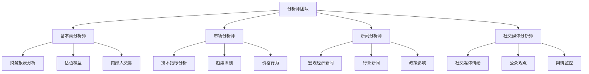
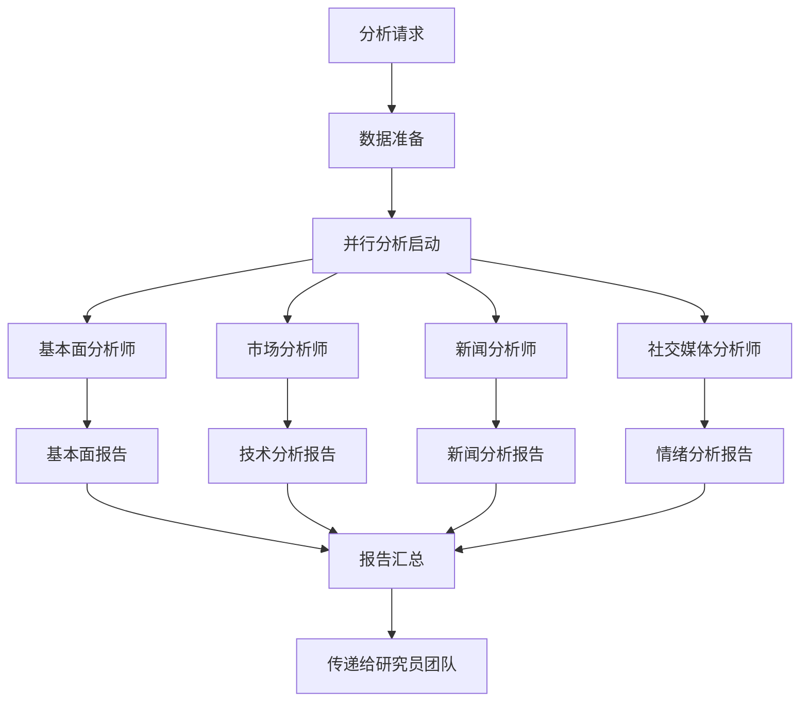

[根目录](../../../../CLAUDE.md) > [tradingagents](../../../CLAUDE.md) > [agents](../../CLAUDE.md) > **analysts**

# 分析师团队 (Analysts Team)

[根目录](../../../../CLAUDE.md) > [tradingagents](../../../CLAUDE.md) > [agents](../../CLAUDE.md) > **analysts**

## 模块概述

分析师团队是 TradingAgents 智能体系统的第一道分析环节，由四位专业分析师组成，分别从基本面、技术面、新闻和社交媒体四个维度对目标公司进行全面分析。每个分析师都具备专业的知识领域和专属的数据工具，为后续的决策流程提供高质量的信息基础。

## 团队架构



## 专业分析师详解

### 1. 基本面分析师 (Fundamentals Analyst)

#### 专业职责
- **公司财务分析**：深入分析公司的财务健康状况和盈利能力
- **估值评估**：运用多种估值方法评估公司内在价值
- **竞争优势分析**：识别和评估公司的核心竞争力和护城河
- **行业地位评估**：分析公司在行业中的地位和未来发展前景

#### 核心工具集
```python
tools = [
    get_fundamentals,        # 综合基本面分析
    get_balance_sheet,       # 资产负债表数据
    get_cashflow,           # 现金流量表数据
    get_income_statement,    # 损益表数据
]
```

#### 分析重点
- **财务比率分析**：PE、PB、ROE、ROA、毛利率等关键财务指标
- **现金流分析**：经营现金流、自由现金流、现金流质量
- **债务结构**：负债率、偿债能力、财务杠杆
- **盈利质量**：收入增长率、利润率趋势、盈利稳定性

#### 报告输出
- 包含详细财务数据的 Markdown 表格
- 关键财务指标的趋势分析
- 公司估值和投资价值的综合评估

### 2. 市场分析师 (Market Analyst)

#### 专业职责
- **技术分析**：运用各种技术指标分析股价走势
- **趋势识别**：识别短期、中期和长期趋势
- **支撑阻力分析**：确定关键的价格支撑和阻力位
- **形态识别**：识别图表中的经典技术形态

#### 智能指标选择策略
系统提供15个技术指标供智能选择：
- **移动平均类**：50-SMA、200-SMA、10-EMA
- **MACD类**：MACD线、MACD信号、MACD柱状图
- **动量类**：RSI（相对强弱指数）
- **波动性类**：布林带（上中下轨）、ATR
- **成交量类**：VWMA（成交量加权移动平均）

#### 核心工具集
```python
tools = [
    get_stock_data,    # 获取OHLCV数据
    get_indicators,    # 计算技术指标
]
```

#### 分析流程
1. **数据获取**：先调用 get_stock_data 获取历史价格数据
2. **指标计算**：基于市场状况智能选择8个最相关指标
3. **趋势分析**：综合多个指标进行趋势判断
4. **信号识别**：识别买入、卖出或持有信号

#### 报告输出
- 选中技术指标的详细解释和适用性
- 当前市场状况的技术分析
- 关键技术位和趋势判断
- 包含关键分析的 Markdown 表格

### 3. 新闻分析师 (News Analyst)

#### 专业职责
- **宏观经济分析**：分析宏观经济新闻对市场的影响
- **行业动态跟踪**：关注行业发展趋势和重大变化
- **政策影响评估**：分析政策变化对公司和行业的影响
- **市场情绪监测**：通过新闻内容判断市场整体情绪

#### 核心工具集
```python
tools = [
    get_news,         # 针对性新闻搜索
    get_global_news,  # 全球宏观新闻
]
```

#### 分析策略
- **公司特定新闻**：搜索目标公司的相关新闻和公告
- **行业新闻**：关注行业整体发展趋势和竞争格局
- **宏观经济新闻**：分析利率、通胀、就业等宏观经济指标
- **政策法规新闻**：关注可能影响公司的监管政策变化

#### 时间范围
- 聚焦过去一周的新闻动态
- 分析新闻的时效性和持续性影响
- 识别短期波动和长期趋势因素

#### 报告输出
- 重要新闻事件的详细分析
- 新闻对目标公司的影响评估
- 市场情绪和预期变化
- 包含关键信息的 Markdown 表格

### 4. 社交媒体分析师 (Social Media Analyst)

#### 专业职责
- **情绪分析**：分析社交媒体上对公司的情绪倾向
- **舆情监控**：监测公众对公司的讨论热点
- **影响者观点**：关注关键意见领袖的观点和分析
- **趋势识别**：识别社交媒体上的讨论趋势变化

#### 核心工具集
```python
tools = [
    get_news,  # 用于搜索社交媒体相关的新闻和讨论
]
```

#### 分析维度
- **情绪倾向**：正面、负面、中性情绪的比例和变化
- **讨论热度**：社交媒体上的讨论量和活跃度
- **关键话题**：公众关注的主要话题和焦点
- **观点变化**：情绪和观点的短期变化趋势

#### 数据来源
- 社交媒体平台的相关讨论
- 投资社区和论坛的观点
- 新闻评论和用户反馈
- 行业专家和分析师的观点

#### 报告输出
- 社交媒体情绪的详细分析
- 公众观点的主要趋势和变化
- 可能影响股价的社交媒体因素
- 包含情绪分析的 Markdown 表格

## 分析师协作模式

### 并行分析流程


### 统一的输出格式
每个分析师都遵循统一的报告格式：
- **详细分析内容**：避免模糊表述，提供具体数据和分析
- **Markdown表格**：使用表格总结关键发现和分析点
- **可读性强**：便于后续研究员理解和引用
- **专业性**：使用专业术语和分析方法

### 工具调用规范
- **错误处理**：优雅处理API调用失败和数据缺失
- **数据验证**：确保获取的数据完整和准确
- **缓存利用**：合理利用数据缓存减少API调用
- **故障转移**：支持多个数据源的自动切换

## 配置和自定义

### 分析师选择配置
```python
# 在config中可以选择启用的分析师
config = {
    "selected_analysts": [
        "fundamentals",  # 基本面分析师
        "market",        # 市场分析师
        "news",          # 新闻分析师
        "social"         # 社交媒体分析师
    ]
}
```

### 自定义分析师开发
开发新的分析师需要遵循以下规范：
```python
from langchain_core.prompts import ChatPromptTemplate, MessagesPlaceholder

def create_custom_analyst(llm):
    def custom_analyst_node(state):
        current_date = state["trade_date"]
        ticker = state["company_of_interest"]

        # 定义专用工具
        tools = [...]

        # 定义专业系统消息
        system_message = "You are a specialized analyst with expertise in..."

        # 创建提示模板
        prompt = ChatPromptTemplate.from_messages([
            ("system", system_message + additional_instructions),
            MessagesPlaceholder(variable_name="messages"),
        ])

        # 执行分析
        chain = prompt | llm.bind_tools(tools)
        result = chain.invoke(state["messages"])

        return {
            "messages": [result],
            "custom_report": result.content if len(result.tool_calls) == 0 else ""
        }

    return custom_analyst_node
```

## 性能优化建议

### 响应速度优化
1. **工具调用优化**：合理选择必要的数据工具，避免过度调用
2. **数据缓存**：充分利用本地缓存减少API请求
3. **并行处理**：多个分析师可以并行执行，提高整体效率
4. **数据预处理**：提前准备常用的市场数据和指标

### 分析质量提升
1. **专业深度**：每个分析师在专业领域保持深度和准确性
2. **数据质量**：确保使用的数据来源可靠和及时
3. **交叉验证**：多个分析师的结果可以相互验证
4. **持续改进**：根据市场反馈不断优化分析方法

## 常见问题 (FAQ)

### Q: 如何确保分析师的数据质量？
A: 通过 dataflows/interface.py 的智能路由机制，优先使用高质量数据源，并支持故障转移到备用数据源。

### Q: 分析师如何处理数据缺失的情况？
A: 系统设计了优雅的错误处理机制，在数据缺失时会基于可用信息进行分析，并在报告中说明数据限制。

### Q: 可以自定义技术指标的权重吗？
A: 市场分析师目前采用智能选择策略，未来版本可以支持用户自定义指标权重和优先级。

### Q: 社交媒体分析师的数据来源有哪些？
A: 目前主要通过新闻工具获取社交媒体相关的讨论和报道，未来可以集成专门的社交媒体API。

### Q: 分析师的报告如何保证客观性？
A: 每个分析师都基于数据和事实进行分析，避免主观判断，通过后续的辩论机制进一步确保客观性。

## 相关文件清单

### 核心分析师文件
- `fundamentals_analyst.py` - 基本面分析师实现
- `market_analyst.py` - 市场分析师实现
- `news_analyst.py` - 新闻分析师实现
- `social_media_analyst.py` - 社交媒体分析师实现

### 支持工具文件
- `../utils/fundamental_data_tools.py` - 基本面数据工具
- `../utils/technical_indicators_tools.py` - 技术指标工具
- `../utils/news_data_tools.py` - 新闻数据工具
- `../utils/core_stock_tools.py` - 核心股票数据工具

### 配置和集成
- `../dataflows/interface.py` - 数据供应商接口
- `../utils/agent_states.py` - 状态管理定义
- `../../graph/setup.py` - 分析师集成配置

## 变更记录 (Changelog)

### v1.0.0 (2024-12-20)
- 创建基础的四位分析师架构
- 实现并行分析流程
- 集成专业的数据工具集
- 建立统一的报告格式

### v1.1.0 (2024-12-20)
- 优化技术指标的智能选择算法
- 改进分析师的提示词和分析逻辑
- 增强数据获取的稳定性
- 完善报告的可读性和专业性

### 下一步计划
- [ ] 添加期权分析师和汇率分析师
- [ ] 实现分析师间的数据共享机制
- [ ] 支持分析师权重和优先级配置
- [ ] 集成更多数据源和社交媒体API
- [ ] 开发分析师性能评估工具

---

分析师团队是整个交易决策系统的基础，通过专业化的多维度分析为后续的深度研究和风险评估提供高质量的信息基础。