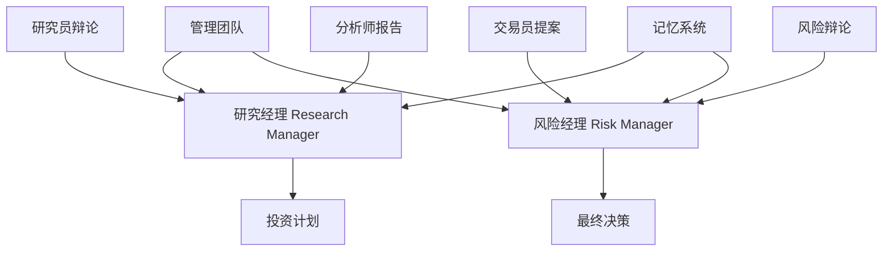
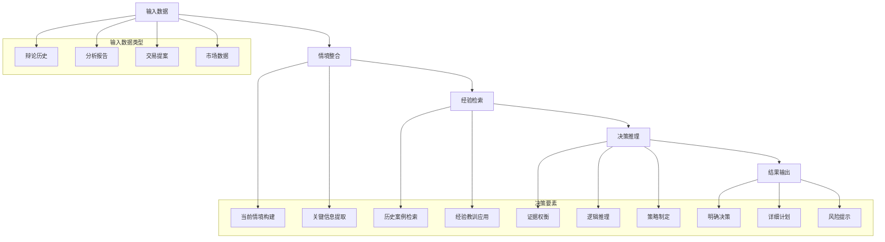

[根目录](../../../../CLAUDE.md) > [tradingagents](../../../CLAUDE.md) > [agents](../../CLAUDE.md) > **managers**

# 管理团队 (Management Team)

[根目录](../../../../CLAUDE.md) > [tradingagents](../../../CLAUDE.md) > [agents](../../CLAUDE.md) > **managers**

## 模块概述

管理团队是 TradingAgents 智能体系统中的决策协调和最终裁决层，由研究经理（Research Manager）和风险经理（Risk Manager）两位核心管理者组成。他们负责协调专业智能体间的辩论过程，综合不同观点做出最终判断，并制定具体的执行计划。管理团队是连接专业分析和最终决策的关键桥梁。

## 团队架构



## 管理者详细分析

### 1. 研究经理 (Research Manager)

#### 角色定位
研究经理是投资辩论的协调者和最终裁决者，负责整合看涨和看跌研究员的辩论内容，基于最有力证据做出明确的投资建议，并制定详细的执行计划。

#### 核心职责

**辩论协调与评估**
- **辩论总结**：提炼看涨和看跌双方的核心观点和关键证据
- **证据权衡**：评估不同论证的说服力和可信度
- **矛盾识别**：识别和解决双方论证中的矛盾和冲突
- **结论综合**：基于辩论结果形成综合性投资判断

**投资决策制定**
- **明确立场**：避免"持有"默认选项，做出明确的买入/卖出建议
- **策略制定**：为交易员制定详细的投资执行策略
- **时机判断**：确定最佳的投资时机和入场策略
- **规模建议**：建议合适的投资规模和仓位管理

**经验学习整合**
- **历史检索**：基于当前情况检索相关历史经验
- **教训吸收**：从历史成功和失败案例中吸取教训
- **模式识别**：识别当前情况与历史案例的相似模式
- **决策优化**：基于经验教训优化当前决策

#### 决策流程
```python
def research_manager_node(state) -> dict:
    # 获取辩论状态和分析报告
    history = state["investment_debate_state"].get("history", "")
    market_research_report = state["market_report"]
    sentiment_report = state["sentiment_report"]
    news_report = state["news_report"]
    fundamentals_report = state["fundamentals_report"]

    # 整合当前情境
    curr_situation = f"{market_research_report}\n\n{sentiment_report}\n\n{news_report}\n\n{fundamentals_report}"

    # 检索历史经验
    past_memories = memory.get_memories(curr_situation, n_matches=2)

    # 构建决策提示词
    prompt = build_decision_prompt(history, curr_situation, past_memories)

    # 执行决策推理
    response = llm.invoke(prompt)

    # 更新状态并返回结果
    return {
        "investment_debate_state": new_investment_debate_state,
        "investment_plan": response.content,
    }
```

#### 专业提示词设计
```python
prompt = f"""As the portfolio manager and debate facilitator, your role is to
critically evaluate this round of debate and make a definitive decision: align
with the bear analyst, the bull analyst, or choose Hold only if it is strongly
justified based on the arguments presented.

Summarize the key points from both sides concisely, focusing on the most
compelling evidence or reasoning. Your recommendation—Buy, Sell, or Hold—must
be clear and actionable. Avoid defaulting to Hold simply because both sides
have valid points; commit to a stance grounded in the debate's strongest
arguments.

Additionally, develop a detailed investment plan for the trader. This should
include:
- Your Recommendation: A decisive stance supported by the most convincing arguments
- Rationale: An explanation of why these arguments lead to your conclusion
- Strategic Actions: Concrete steps for implementing the recommendation

Take into account your past mistakes on similar situations. Use these insights
to refine your decision-making and ensure you are learning and improving."""
```

### 2. 风险经理 (Risk Manager)

#### 角色定位
风险经理是风险评估辩论的协调者和最终风险决策者，负责评估激进、保守、中立三种风险观点，基于交易员的提案进行风险调整，并输出最终的风险调整后交易决策。

#### 核心职责

**风险辩论协调**
- **观点平衡**：平衡激进、保守、中立三种风险观点
- **风险评估**：综合评估交易提案的各类风险因素
- **风险调整**：基于风险评估调整原始交易提案
- **最终裁决**：做出最终的风险调整后投资决策

**交易提案优化**
- **提案分析**：深入分析交易员提交的投资提案
- **风险识别**：识别提案中的关键风险点和潜在问题
- **方案调整**：基于风险评估调整投资方案和执行策略
- **监控建议**：提供投资执行过程中的风险监控建议

**经验整合应用**
- **风险教训**：从历史风险管理案例中吸取教训
- **模式匹配**：识别当前风险情况与历史案例的相似性
- **策略优化**：基于经验优化风险管理策略
- **持续改进**：根据决策结果不断改进风险管理方法

#### 决策流程
```python
def risk_manager_node(state) -> dict:
    # 获取风险辩论状态和交易提案
    history = state["risk_debate_state"]["history"]
    trader_plan = state["investment_plan"]

    # 获取基础分析报告
    market_research_report = state["market_report"]
    news_report = state["news_report"]
    fundamentals_report = state["fundamentals_report"]
    sentiment_report = state["sentiment_report"]

    # 整合情境和检索经验
    curr_situation = f"{market_research_report}\n\n{sentiment_report}\n\n{news_report}\n\n{fundamentals_report}"
    past_memories = memory.get_memories(curr_situation, n_matches=2)

    # 构建风险管理提示词
    prompt = build_risk_management_prompt(history, trader_plan, curr_situation, past_memories)

    # 执行风险决策推理
    response = llm.invoke(prompt)

    # 更新状态并返回结果
    return {
        "risk_debate_state": new_risk_debate_state,
        "final_trade_decision": response.content,
    }
```

#### 专业提示词设计
```python
prompt = f"""As the Risk Management Judge and Debate Facilitator, your goal is to
evaluate the debate between three risk analysts—Risky, Neutral, and Safe/Conservative—and
determine the best course of action for the trader. Your decision must result in a
clear recommendation: Buy, Sell, or Hold. Choose Hold only if strongly justified by
specific arguments, not as a fallback when all sides seem valid. Strive for clarity
and decisiveness.

Guidelines for Decision-Making:
1. Summarize Key Arguments: Extract the strongest points from each analyst, focusing
   on relevance to the context.
2. Provide Rationale: Support your recommendation with direct quotes and
   counterarguments from the debate.
3. Refine the Trader's Plan: Start with the trader's original plan and adjust it
   based on the analysts' insights.
4. Learn from Past Mistakes: Use lessons from past reflections to address prior
   misjudgments and improve the decision you are making now.

Deliverables:
- A clear and actionable recommendation: Buy, Sell, or Hold.
- Detailed reasoning anchored in the debate and past reflections."""
```

## 管理决策机制

### 决策流程图


### 记忆学习机制

#### 情境检索策略
```python
# 构建当前情境描述
curr_situation = f"""
市场研究报告:
{market_research_report}

情感分析报告:
{sentiment_report}

新闻报告:
{news_report}

基本面报告:
{fundamentals_report}
"""

# 检索相关历史经验
past_memories = memory.get_memories(curr_situation, n_matches=2)

# 整合历史教训
past_memory_str = ""
for i, rec in enumerate(past_memories, 1):
    past_memory_str += f"经验{i}: {rec['recommendation']}\n\n"
```

#### 学习内容整合
- **成功案例**：分析成功决策的关键因素
- **失败教训**：识别失败决策的共性问题
- **模式识别**：发现决策模式和市场规律
- **持续改进**：基于反馈不断优化决策质量

### 决策质量控制

#### 明确性要求
- **避免中性偏误**：要求管理者做出明确的买入/持有/卖出决策
- **证据支撑**：每个决策都必须有充分的理由和证据支撑
- **可操作性**：决策必须包含具体的执行计划和操作指导

#### 逻辑一致性
- **内部逻辑**：确保推理过程逻辑严密，前后一致
- **外部一致**：决策与分析师报告和辩论内容保持一致
- **经验一致**：与历史经验教训保持一致

## 核心实现技术

### 状态管理模式
```python
# 研究经理状态更新
new_investment_debate_state = {
    "judge_decision": response.content,              # 经理决策
    "history": investment_debate_state.get("history", ""),
    "bear_history": investment_debate_state.get("bear_history", ""),
    "bull_history": investment_debate_state.get("bull_history", ""),
    "current_response": response.content,            # 当前回应
    "count": investment_debate_state["count"],       # 保持原有计数
}

# 风险经理状态更新
new_risk_debate_state = {
    "judge_decision": response.content,              # 经理决策
    "history": risk_debate_state["history"],
    "risky_history": risk_debate_state["risky_history"],
    "safe_history": risk_debate_state["safe_history"],
    "neutral_history": risk_debate_state["neutral_history"],
    "latest_speaker": "Judge",
    "current_risky_response": risk_debate_state["current_risky_response"],
    "current_safe_response": risk_debate_state["current_safe_response"],
    "current_neutral_response": risk_debate_state["current_neutral_response"],
    "count": risk_debate_state["count"],             # 保持原有计数
}
```

### 工厂函数架构
```python
def create_research_manager(llm, memory):
    def research_manager_node(state) -> dict:
        # 完整的研究经理逻辑实现
        pass
    return research_manager_node

def create_risk_manager(llm, memory):
    def risk_manager_node(state) -> dict:
        # 完整的风险经理逻辑实现
        pass
    return risk_manager_node
```

## 配置和自定义

### 决策参数配置
```python
config = {
    "memory_matches": 2,                    # 检索历史经验数量
    "decision_confidence_threshold": 0.7,   # 决策置信度阈值
    "plan_detail_level": "high",            # 计划详细程度
    "risk_adjustment_factor": 1.2,          # 风险调整因子
}
```

### 自定义管理角色
```python
def create_custom_manager(llm, memory, manager_type, decision_framework):
    def custom_manager_node(state):
        # 获取相关输入数据
        input_data = get_manager_input(state, manager_type)

        # 检索相关经验
        past_memories = memory.get_memories(input_data["situation"], n_matches=2)

        # 构建专业提示词
        prompt = build_manager_prompt(manager_type, decision_framework, input_data, past_memories)

        # 执行决策推理
        response = llm.invoke(prompt)

        # 更新状态并返回
        return update_manager_state(state, response, manager_type)

    return custom_manager_node
```

### 决策框架配置
```python
# 价值投资框架
value_investing_framework = {
    "focus_factors": ["intrinsic_value", "margin_of_safety", "quality"],
    "decision_rules": ["buy_below_value", "sell_above_value", "hold_others"],
}

# 成长投资框架
growth_investing_framework = {
    "focus_factors": ["growth_rate", "market_potential", "innovation"],
    "decision_rules": ["high_growth_buy", "low_growth_sell", "moderate_hold"],
}

# 风险平价框架
risk_parity_framework = {
    "focus_factors": ["risk_contribution", "correlation", "volatility"],
    "decision_rules": ["risk_balanced", "diversified", "volatility_adjusted"],
}
```

## 性能优化建议

### 决策速度优化
1. **经验缓存**：缓存常用的历史经验检索结果
2. **模板复用**：复用决策模板和框架
3. **并行准备**：并行准备决策所需的各类数据
4. **增量更新**：基于市场变化增量更新决策

### 决策质量提升
1. **经验丰富化**：不断增加高质量的历史决策案例
2. **框架优化**：持续优化决策框架和评估标准
3. **反馈学习**：基于实际结果反馈调整决策逻辑
4. **多样化**：引入多种决策视角和方法

## 常见问题 (FAQ)

### Q: 如何确保管理者决策的客观性？
A: 通过基于数据和证据的决策框架，结合历史经验教训，避免主观偏见影响决策。

### Q: 记忆系统如何支持管理者决策？
A: 基于向量嵌入的相似性搜索，为管理者提供相关的历史案例和经验教训。

### Q: 如何处理决策中的不确定性？
A: 通过概率思维、情景分析和敏感性分析，系统性地处理和量化不确定性。

### Q: 管理者如何学习改进决策质量？
A: 通过记忆系统存储决策结果，基于实际表现不断优化决策框架和提示词。

### Q: 可以添加其他类型的管理者吗？
A: 可以根据需要添加专门的管理角色，如投资组合经理、合规经理等。

## 相关文件清单

### 核心管理者文件
- `research_manager.py` - 研究经理实现
- `risk_manager.py` - 风险经理实现

### 支持系统文件
- `../utils/memory.py` - 向量记忆系统
- `../utils/agent_states.py` - 状态管理
- `../researchers/` - 研究员团队
- `../risk_mgmt/` - 风险管理团队
- `../trader/trader.py` - 交易员

### 决策支持工具
- `../../dataflows/interface.py` - 数据接口
- `../../graph/setup.py` - 图配置

## 变更记录 (Changelog)

### v1.0.0 (2024-12-20)
- 建立研究经理和风险经理架构
- 实现基于记忆学习的决策机制
- 集成专业辩论的综合评估
- 设计明确的决策输出格式

### v1.1.0 (2024-12-20)
- 优化管理者的专业提示词和决策框架
- 改进经验检索和学习机制
- 增强决策的可解释性和可操作性
- 完善状态管理和信息传递

### 下一步计划
- [ ] 添加投资组合经理角色
- [ ] 实现更复杂的决策优化算法
- [ ] 集成实时市场反馈机制
- [ ] 开发决策质量评估工具
- [ ] 支持多资产类别管理

---

管理团队通过专业的协调和决策能力，确保整个智能体系统输出高质量、可执行的投资决策，是连接专业分析和实际交易的关键环节。