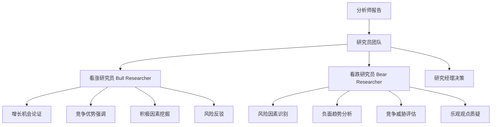
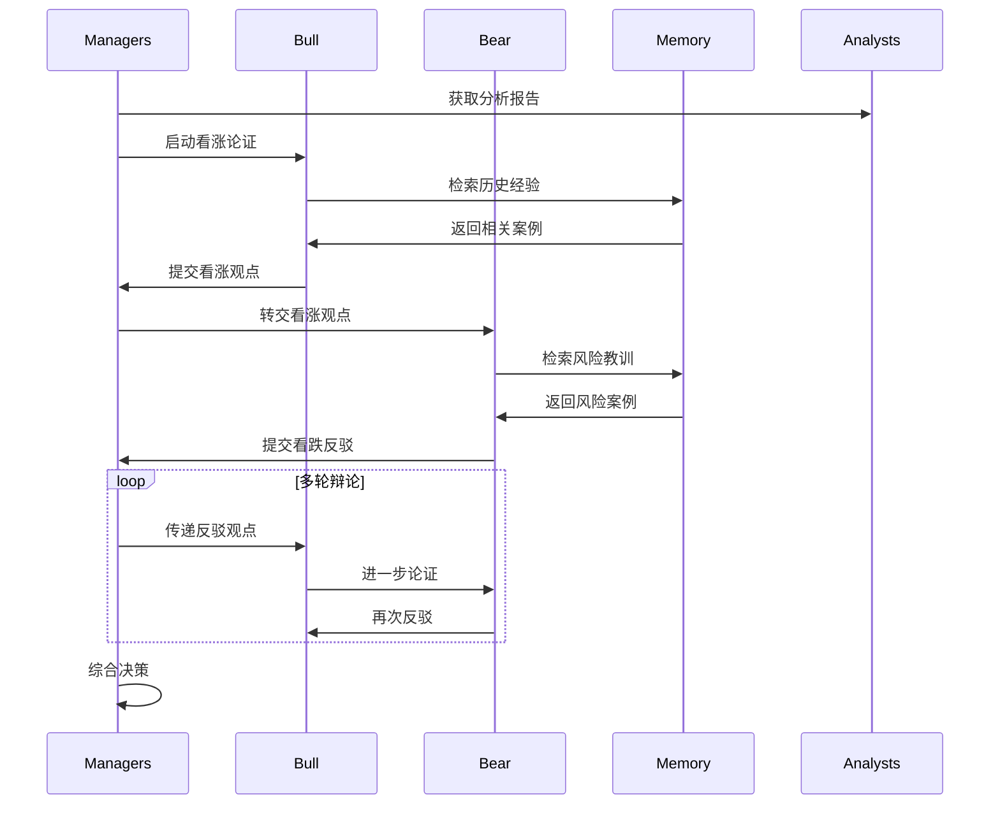

[根目录](../../../../CLAUDE.md) > [tradingagents](../../../CLAUDE.md) > [agents](../../CLAUDE.md) > **researchers**

# 研究员团队 (Researchers Team)

[根目录](../../../../CLAUDE.md) > [tradingagents](../../../CLAUDE.md) > [agents](../../CLAUDE.md) > **researchers**

## 模块概述

研究员团队是 TradingAgents 智能体系统中的深度研究环节，由看涨研究员（Bull Researcher）和看跌研究员（Bear Researcher）组成。基于分析师团队提供的多维度分析报告，两位研究员通过结构化的辩论机制，从不同投资观点出发进行深入论证，确保决策过程的全面性和客观性。

## 团队架构



## 研究员详细分析

### 1. 看涨研究员 (Bull Researcher)

#### 投资理念
看涨研究员负责构建和捍卫看涨投资观点，重点关注公司的成长潜力、竞争优势和积极的市场因素。

#### 核心论证策略

**增长潜力论证**
- **市场机会**：分析公司所在市场的增长潜力和扩张空间
- **收入增长**：评估历史增长趋势和未来增长预期
- **产品创新**：关注公司的产品创新能力和市场接受度
- **竞争优势**：识别并强调公司的核心竞争力和护城河

**积极因素挖掘**
- **技术优势**：分析公司在技术、专利、研发方面的优势
- **管理团队**：评估管理层的执行力和战略眼光
- **财务健康**：强调公司的财务稳定性和盈利能力
- **行业地位**：突出公司在行业中的领导地位

**风险反驳策略**
- **数据驱动反驳**：使用具体数据和事实反驳看跌观点
- **历史对比**：通过历史案例证明公司的抗风险能力
- **市场趋势**：结合宏观趋势支持看涨观点
- **成长叙事**：构建有说服力的成长故事和投资逻辑

#### 记忆学习机制
```python
# 基于相似情境检索历史经验
past_memories = memory.get_memories(curr_situation, n_matches=2)

# 从历史成功案例中学习
past_memory_str = ""
for i, rec in enumerate(past_memories, 1):
    past_memory_str += rec["recommendation"] + "\n\n"
```

#### 辩论技巧
- **直接回应**：直接回应看跌研究员的观点和担忧
- **证据支撑**：使用分析师报告中的具体数据支撑观点
- **经验引用**：引用历史成功案例加强论证
- **情感共鸣**：构建积极的投资愿景和故事

### 2. 看跌研究员 (Bear Researcher)

#### 投资理念
看跌研究员负责识别和强调投资风险，从谨慎的角度分析投资决策的潜在问题和威胁。

#### 核心论证策略

**风险因素识别**
- **市场风险**：分析市场饱和、竞争加剧等外部风险
- **财务风险**：评估公司的财务杠杆、现金流状况
- **运营风险**：关注供应链、生产、管理等内部风险
- **估值风险**：分析当前估值是否过高，是否存在泡沫

**负面趋势分析**
- **行业挑战**：识别行业面临的结构性挑战和变化
- **竞争威胁**：分析来自竞争对手的威胁和压力
- **监管风险**：关注政策变化和监管环境的潜在影响
- **技术替代**：评估新技术对现有业务的冲击

**质疑策略**
- **假设质疑**：质疑看涨观点中的关键假设
- **数据质疑**：质疑数据解读的客观性和完整性
- **趋势质疑**：质疑历史趋势的可持续性
- **估值质疑**：质疑当前估值的合理性和支撑

#### 记忆学习机制
```python
# 基于相似情境检索历史教训
past_memories = memory.get_memories(curr_situation, n_matches=2)

# 从历史失败案例中吸取教训
past_memory_str = ""
for i, rec in enumerate(past_memories, 1):
    past_memory_str += rec["recommendation"] + "\n\n"
```

#### 辩论技巧
- **系统性分析**：从多个系统角度分析风险
- **案例警示**：引用历史失败案例作为警示
- **量化分析**：使用量化指标支持风险判断
- **保守原则**：坚持保守的投资原则和风险控制

## 辩论机制设计

### 辩论流程


### 辩论规则
- **交替发言**：看涨和看跌研究员交替发言
- **引用证据**：必须引用分析师报告中的具体数据
- **历史学习**：每轮都要考虑相似历史情况的经验教训
- **建设性质疑**：质疑要基于事实和逻辑，避免情绪化
- **完整性要求**：回应要全面，避免选择性地忽视不利信息

### 状态管理
```python
new_investment_debate_state = {
    "history": history + "\n" + argument,                    # 完整辩论历史
    "bull_history": bull_history + "\n" + argument,          # 看涨观点历史
    "bear_history": bear_history + "\n" + argument,          # 看跌观点历史
    "current_response": argument,                            # 当前最新回应
    "count": investment_debate_state["count"] + 1,           # 辩论轮次计数
}
```

## 核心实现技术

### 工厂函数模式
```python
def create_bull_researcher(llm, memory):
    def bull_node(state) -> dict:
        # 获取当前状态和分析报告
        investment_debate_state = state["investment_debate_state"]
        market_research_report = state["market_report"]
        # ... 其他报告

        # 检索历史经验
        curr_situation = f"{market_research_report}\n\n{sentiment_report}\n\n..."
        past_memories = memory.get_memories(curr_situation, n_matches=2)

        # 构建专业提示词
        prompt = f"""You are a Bull Analyst advocating for investing...
        # 详细的专业提示词内容
        """

        # 执行LLM推理
        response = llm.invoke(prompt)

        # 更新状态并返回
        return {"investment_debate_state": new_investment_debate_state}

    return bull_node
```

### 提示工程策略

#### 角色定义清晰
```python
# 看涨研究员提示词关键要素
prompt = f"""You are a Bull Analyst advocating for investing in the stock.
Your task is to build a strong, evidence-based case emphasizing:
- Growth Potential
- Competitive Advantages
- Positive Indicators
- Bear Counterpoints
- Engagement"""
```

#### 数据整合规范
```python
# 标准化的数据来源引用
Resources available:
- Market research report: {market_research_report}
- Social media sentiment report: {sentiment_report}
- Latest world affairs news: {news_report}
- Company fundamentals report: {fundamentals_report}
- Conversation history: {history}
- Last argument: {current_response}
- Historical lessons: {past_memory_str}
```

#### 输出格式要求
- **对话风格**：以自然对话的方式呈现观点
- **具体证据**：提供具体的支撑证据和数据
- **直接回应**：直接回应对方的观点和质疑
- **学习整合**：整合历史经验教训

## 配置和自定义

### 辩论轮数控制
```python
config = {
    "max_debate_rounds": 1,  # 控制辩论的最大轮数
}
```

### 自定义研究员开发
```python
def create_custom_researcher(llm, memory, perspective):
    def custom_researcher_node(state):
        # 获取基础分析数据
        analysis_reports = collect_analysis_reports(state)

        # 检索相关经验
        past_memories = memory.get_memories(analysis_reports, n_matches=2)

        # 构建特定观点的提示词
        prompt = build_perspective_prompt(perspective, analysis_reports, past_memories)

        # 执行分析
        response = llm.invoke(prompt)

        # 更新辩论状态
        return update_debate_state(state, response, perspective)

    return custom_researcher_node
```

### 记忆系统配置
```python
# 配置记忆检索参数
memory_config = {
    "embedding_model": "text-embedding-3-small",
    "n_matches": 2,                    # 检索的历史经验数量
    "similarity_threshold": 0.7,       # 相似度阈值
    "max_memory_size": 10000,         # 最大记忆容量
}
```

## 性能优化建议

### 响应速度优化
1. **记忆缓存**：缓存常用的历史经验检索结果
2. **并行准备**：在辩论开始前预加载和分析报告
3. **提示词优化**：减少不必要的上下文信息
4. **模型选择**：根据辩论复杂度选择合适的LLM模型

### 分析质量提升
1. **经验丰富化**：不断增加高质量的历史案例
2. **提示词迭代**：基于实际表现持续优化提示词
3. **辩论结构**：设计更结构化的辩论流程
4. **权重调整**：根据历史表现调整不同证据的权重

## 常见问题 (FAQ)

### Q: 如何避免研究员陷入无意义的争论？
A: 通过专业的提示词设计，要求研究员基于数据和事实进行建设性辩论，并设置合理的辩论轮数限制。

### Q: 记忆系统如何选择相关的历史经验？
A: 使用向量嵌入技术，基于当前分析报告的内容相似度检索最相关的历史决策案例。

### Q: 看涨和看跌研究员的观点如何确保平衡？
A: 通过相同的分析数据基础和对称的角色定义，确保双方都能获得充分的信息和表达机会。

### Q: 辩论结果如何保证客观性？
A: 研究经理负责综合双方的论证，基于最有力证据做出判断，而不是简单的观点平衡。

### Q: 可以添加更多观点的研究员吗？
A: 可以扩展研究团队，添加如"中性研究员"、"行业专家"等不同观点的专家角色。

## 相关文件清单

### 核心研究员文件
- `bull_researcher.py` - 看涨研究员实现
- `bear_researcher.py` - 看跌研究员实现

### 支持系统文件
- `../utils/memory.py` - 向量记忆系统
- `../utils/agent_states.py` - 状态管理
- `../managers/research_manager.py` - 研究经理
- `../dataflows/interface.py` - 数据接口

### 辩论流程文件
- `../../graph/conditional_logic.py` - 条件逻辑控制
- `../../graph/setup.py` - 图配置和集成

## 变更记录 (Changelog)

### v1.0.0 (2024-12-20)
- 建立基础的双研究员辩论架构
- 实现基于向量记忆的经验学习机制
- 集成分析师报告的全面引用
- 设计结构化的辩论流程

### v1.1.0 (2024-12-20)
- 优化研究员的专业提示词和论证策略
- 改进历史经验的检索和整合机制
- 增强辩论的对话性和建设性
- 完善状态管理和辩论流程控制

### 下一步计划
- [ ] 添加中性研究员观点
- [ ] 实现更复杂的辩论权重机制
- [ ] 支持行业专家和策略分析师角色
- [ ] 开发辩论质量评估工具
- [ ] 集成实时市场数据到辩论过程

---

研究员团队通过深度辩论确保投资决策的全面性和客观性，为后续的交易决策提供坚实的研究基础。