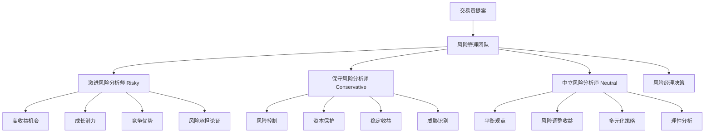
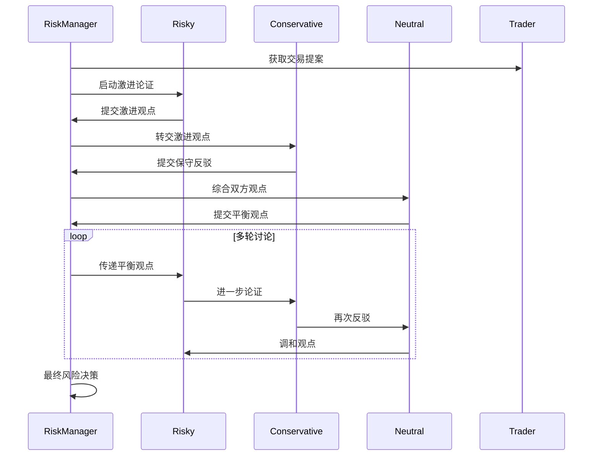

[根目录](../../../../CLAUDE.md) > [tradingagents](../../../CLAUDE.md) > [agents](../../CLAUDE.md) > **risk_mgmt**

# 风险管理团队 (Risk Management Team)

[根目录](../../../../CLAUDE.md) > [tradingagents](../../../CLAUDE.md) > [agents](../../CLAUDE.md) > **risk_mgmt**

## 模块概述

风险管理团队是 TradingAgents 智能体系统中的关键风险控制环节，由激进风险分析师（Risky Debator）、保守风险分析师（Conservative Debator）和中立风险分析师（Neutral Debator）三位专家组成。团队基于交易员的投资提案，从不同风险偏好角度进行全面评估，通过结构化的风险辩论机制，确保最终交易决策在风险和收益之间找到最佳平衡点。

## 团队架构



## 风险分析师详解

### 1. 激进风险分析师 (Aggressive Debator)

#### 风险哲学
激进风险分析师采用积极进取的风险管理策略，专注于识别和抓住高回报机会，在可接受的风险水平内追求最大收益。

#### 核心论证策略

**高收益机会识别**
- **成长潜力**：识别公司的高速成长机会和市场扩张空间
- **创新优势**：强调技术创新、商业模式创新带来的竞争优势
- **市场时机**：识别有利的市场时机和投资窗口
- **行业趋势**：把握行业发展趋势和结构性机会

**风险承担论证**
- **风险溢价**：论证高风险投资应有的风险溢价和回报补偿
- **信息优势**：强调基于专业分析的信息优势和判断准确性
- **时机把握**：论证当前时机下承担特定风险的合理性
- **分散效应**：分析投资组合分散化对单个风险的影响

**乐观因素挖掘**
- **技术突破**：关注技术突破可能带来的爆发式增长
- **市场情绪**：利用市场情绪和预期的正向驱动
- **政策支持**：分析政策环境和监管支持的积极影响
- **竞争格局**：识别竞争格局变化带来的机会

#### 反驳策略
- **质疑保守观点**：挑战保守分析师对风险的过度担忧
- **机会成本分析**：分析过度保守的机会成本
- **历史案例**：引用成功的高风险高回报案例
- **数据支撑**：用具体数据支持激进观点的合理性

### 2. 保守风险分析师 (Conservative Debator)

#### 风险哲学
保守风险分析师采用稳健审慎的风险管理策略，优先考虑资本安全和风险控制，在确保安全的前提下追求稳定收益。

#### 核心论证策略

**风险控制优先**
- **资本保护**：将资本安全置于收益最大化之上
- **风险识别**：系统性地识别和评估各类风险因素
- **安全边际**：强调投资中的安全边际和下行保护
- **流动性管理**：关注投资的流动性和退出机制

**威胁识别与分析**
- **市场风险**：分析市场波动、趋势逆转等系统性风险
- **公司风险**：评估公司财务、经营、管理等特定风险
- **估值风险**：质疑当前估值的合理性和泡沫风险
- **外部风险**：关注宏观经济、政策、行业等外部风险

**稳健策略建议**
- **分批投入**：建议分阶段投入以降低一次性风险
- **止损策略**：制定明确的止损机制和风险控制措施
- **多元化配置**：建议通过多元化分散特定风险
- **保守预期**：调整收益预期以匹配风险水平

#### 质疑策略
- **挑战乐观假设**：质疑激进观点中的关键假设
- **风险量化**：量化分析和展示潜在损失风险
- **历史警示**：引用历史投资失败案例作为警示
- **保守原则**：坚持经典的投资保守原则

### 3. 中立风险分析师 (Neutral Debator)

#### 风险哲学
中立风险分析师采用平衡理性的风险管理策略，在激进和保守观点之间寻找最优平衡点，致力于实现风险调整后的最佳收益。

#### 核心论证策略

**平衡观点整合**
- **风险收益平衡**：在风险和收益之间找到最佳平衡点
- **多维分析**：从多个维度综合评估投资机会
- **情景分析**：分析不同情景下的投资表现
- **敏感性分析**：评估关键变量变化对投资的影响

**理性分析框架**
- **客观评估**：基于客观数据和逻辑进行分析
- **量化模型**：运用量化模型支持风险评估
- **概率思维**：采用概率思维评估不同结果的概率
- **预期收益**：计算风险调整后的预期收益率

**策略优化建议**
- **动态调整**：根据市场情况动态调整风险暴露
- **组合优化**：在投资组合层面优化风险配置
- **对冲策略**：建议适当的风险对冲措施
- **监控机制**：建立持续的风险监控和调整机制

#### 调和作用
- **观点整合**：整合激进和保守观点的合理部分
- **中间道路**：寻找介于两种极端之间的最优路径
- **实际可行**：确保建议在实际操作中可行
- **长期视角**：从长期投资角度评估风险和收益

## 风险辩论机制

### 三方辩论流程


### 状态管理机制
```python
new_risk_debate_state = {
    "history": history + "\n" + argument,                    # 完整辩论历史
    "risky_history": risky_history + "\n" + argument,        # 激进观点历史
    "safe_history": safe_history + "\n" + argument,          # 保守观点历史
    "neutral_history": neutral_history + "\n" + argument,    # 中立观点历史
    "latest_speaker": speaker_type,                          # 最新发言者
    "current_risky_response": latest_risky,                  # 最新激进回应
    "current_safe_response": latest_safe,                    # 最新保守回应
    "current_neutral_response": latest_neutral,              # 最新中立回应
    "count": risk_debate_state["count"] + 1,                 # 辩论轮次
}
```

### 轮换发言机制
- **轮流制**：三位风险分析师按顺序轮流发言
- **响应制**：每位分析师需要回应前一位的观点
- **引用制**：必须引用交易员提案和其他分析师的观点
- **进展制**：每轮都要推进讨论，避免重复

## 核心实现技术

### 统一的工厂函数模式
```python
def create_risky_debator(llm):
    def risky_node(state) -> dict:
        # 获取当前状态
        risk_debate_state = state["risk_debate_state"]
        trader_decision = state["trader_investment_plan"]

        # 获取分析报告
        market_research_report = state["market_report"]
        sentiment_report = state["sentiment_report"]
        # ... 其他报告

        # 构建激进风险分析提示词
        prompt = f"""As the Risky Risk Analyst, your role is to actively champion
        high-reward, high-risk opportunities...
        # 详细的专业提示词内容
        """

        # 执行LLM推理
        response = llm.invoke(prompt)

        # 更新状态并返回
        return {"risk_debate_state": new_risk_debate_state}

    return risky_node
```

### 专业化提示词设计

#### 激进风险分析师提示词
```python
prompt = f"""As the Risky Risk Analyst, your role is to actively champion
high-reward, high-risk opportunities, emphasizing bold strategies and
competitive advantages. When evaluating the trader's decision or plan, focus
intently on the potential upside, growth potential, and innovative benefits.

Key responsibilities:
- Question conservative viewpoints
- Highlight missed opportunities
- Counter with data-driven rebuttals
- Emphasize benefits of risk-taking"""
```

#### 保守风险分析师提示词
```python
prompt = f"""As the Safe/Conservative Risk Analyst, your primary objective is to
protect assets, minimize volatility, and ensure steady, reliable growth. You
prioritize stability, security, and risk mitigation.

Key responsibilities:
- Examine high-risk elements critically
- Point out potential threats
- Highlight more cautious alternatives
- Emphasize potential downsides"""
```

#### 中立风险分析师提示词
```python
prompt = f"""As the Neutral Risk Analyst, your role is to provide a balanced
perspective, weighing both the potential benefits and risks. You prioritize a
well-rounded approach, evaluating upsides and downsides while factoring in
broader market trends.

Key responsibilities:
- Challenge both extremes
- Point out over-optimism/over-cautiousness
- Advocate for moderate, sustainable strategies
- Demonstrate balanced benefits"""
```

## 风险评估维度

### 系统性风险
- **市场风险**：整体市场波动、系统性危机
- **宏观经济风险**：经济周期、通胀、利率变化
- **政策风险**：监管变化、政策不确定性
- **地缘政治风险**：国际关系、贸易冲突

### 非系统性风险
- **公司特定风险**：财务风险、经营风险、管理风险
- **行业风险**：行业周期、技术变革、竞争格局
- **估值风险**：估值泡沫、价格偏离基本面
- **流动性风险**：市场流动性、退出机制

### 风险评估工具
- **量化分析**：VaR、CVaR、波动率、相关性
- **情景分析**：压力测试、情景模拟
- **敏感性分析**：关键参数敏感性测试
- **风险指标**：夏普比率、最大回撤、贝塔系数

## 配置和自定义

### 风险偏好配置
```python
config = {
    "max_risk_discuss_rounds": 1,        # 风险讨论轮数
    "risk_appetite": "moderate",          # 整体风险偏好
    "risk_tolerance": 0.15,              # 风险承受度
    "max_position_size": 0.10,           # 最大头寸规模
}
```

### 自定义风险分析师
```python
def create_custom_risk_analyst(llm, risk_profile):
    def custom_risk_node(state):
        # 获取交易提案和分析报告
        trader_decision = state["trader_investment_plan"]
        analysis_reports = get_all_analysis_reports(state)

        # 构建特定风险偏好的提示词
        prompt = build_risk_prompt(risk_profile, trader_decision, analysis_reports)

        # 执行风险分析
        response = llm.invoke(prompt)

        # 更新风险辩论状态
        return update_risk_debate_state(state, response, risk_profile)

    return custom_risk_node
```

### 风险权重配置
```python
risk_weights = {
    "market_risk": 0.30,        # 市场风险权重
    "credit_risk": 0.20,        # 信用风险权重
    "operational_risk": 0.15,   # 操作风险权重
    "liquidity_risk": 0.10,     # 流动性风险权重
    "valuation_risk": 0.25,     # 估值风险权重
}
```

## 性能优化建议

### 响应速度优化
1. **风险预计算**：提前计算常用的风险指标
2. **模板复用**：复用风险分析模板和框架
3. **并行处理**：三位分析师可以并行准备观点
4. **增量更新**：基于市场变化增量更新风险评估

### 分析质量提升
1. **风险数据库**：建立历史风险事件数据库
2. **模型优化**：持续优化风险评估模型
3. **专家系统**：集成专业风险管理知识
4. **回测验证**：通过历史回测验证风险评估准确性

## 常见问题 (FAQ)

### Q: 三位风险分析师如何确保观点的多样性？
A: 通过不同的风险哲学、专业背景和分析框架，确保三位分析师从不同角度评估风险。

### Q: 风险辩论如何避免陷入极端观点？
A: 中立分析师起到调和作用，确保讨论在理性范围内，风险经理负责最终平衡决策。

### Q: 风险评估如何考虑时间维度？
A: 系统考虑短期、中期和长期不同时间维度的风险因素，动态调整风险评估。

### Q: 如何量化不同观点的权重？
A: 基于历史表现和市场环境，动态调整三位风险分析师观点的权重。

### Q: 风险管理团队如何适应不同类型投资？
A: 可以根据投资类型（股票、债券、衍生品等）调整风险评估重点和方法。

## 相关文件清单

### 核心风险管理文件
- `aggresive_debator.py` - 激进风险分析师实现
- `conservative_debator.py` - 保守风险分析师实现
- `neutral_debator.py` - 中立风险分析师实现

### 支持系统文件
- `../utils/agent_states.py` - 状态管理
- `../managers/risk_manager.py` - 风险经理
- `../trader/trader.py` - 交易员提案
- `../dataflows/interface.py` - 数据接口

### 风险评估工具
- `../../utils/technical_indicators_tools.py` - 技术风险指标
- `../../utils/fundamental_data_tools.py` - 基本面风险数据

## 变更记录 (Changelog)

### v1.0.0 (2024-12-20)
- 建立三方风险分析师架构
- 实现结构化的风险辩论机制
- 集成交易员提案的全面评估
- 设计平衡的风险决策流程

### v1.1.0 (2024-12-20)
- 优化各风险分析师的专业提示词
- 改进风险辩论的对话性和建设性
- 增强风险评估的量化分析能力
- 完善轮换发言和状态管理机制

### 下一步计划
- [ ] 添加量化风险分析师角色
- [ ] 实现更复杂的风险建模工具
- [ ] 集成实时风险监控系统
- [ ] 开发风险压力测试模块
- [ ] 支持动态风险权重调整

---

风险管理团队通过多维度的风险辩论确保交易决策的安全性和合理性，为最终的投资决策提供全面的风险保障。