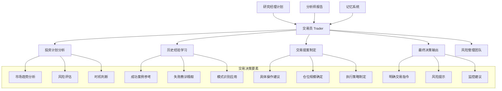

[根目录](../../../../CLAUDE.md) > [tradingagents](../../../CLAUDE.md) > [agents](../../CLAUDE.md) > **trader**

# 交易执行 (Trader)

[根目录](../../../../CLAUDE.md) > [tradingagents](../../../CLAUDE.md) > [agents](../../CLAUDE.md) > **trader**

## 模块概述

交易执行模块是 TradingAgents 智能体系统中的最终决策执行环节，由专业的交易员智能体负责基于研究经理的投资计划，制定具体的交易执行提案。交易员整合所有前期分析结果，结合历史交易经验，输出明确的买入/持有/卖出交易建议，为最终的风险评估提供基础。

## 核心架构



## 交易员智能体详解

### 核心职责

#### 投资计划分析
- **计划解读**：深入理解研究经理提供的投资计划和建议
- **可行性评估**：评估投资计划在实际市场环境中的可行性
- **执行策略**：制定具体的市场执行策略和操作步骤
- **时机选择**：确定最佳的交易时机和入场/出场点

#### 市场环境评估
- **技术分析**：结合市场技术分析确定交易时机
- **情绪分析**：考虑市场情绪对交易执行的影响
- **流动性分析**：评估市场流动性和交易成本
- **风险识别**：识别执行过程中的潜在风险

#### 历史经验整合
- **模式识别**：识别当前情况与历史交易案例的相似模式
- **教训应用**：应用历史成功和失败案例的教训
- **策略优化**：基于历史经验优化当前交易策略
- **风险控制**：应用历史风险管理经验

### 交易决策流程

```python
def create_trader(llm, memory):
    def trader_node(state, name):
        # 获取公司信息和投资计划
        company_name = state["company_of_interest"]
        investment_plan = state["investment_plan"]

        # 获取所有分析报告
        market_research_report = state["market_report"]
        sentiment_report = state["sentiment_report"]
        news_report = state["news_report"]
        fundamentals_report = state["fundamentals_report"]

        # 构建当前情境
        curr_situation = f"{market_research_report}\n\n{sentiment_report}\n\n{news_report}\n\n{fundamentals_report}"

        # 检索历史交易经验
        past_memories = memory.get_memories(curr_situation, n_matches=2)

        # 构建交易决策提示词
        messages = [
            {
                "role": "system",
                "content": f"""You are a trading agent analyzing market data to make investment
                decisions. Based on your analysis, provide a specific recommendation to buy,
                sell, or hold. End with a firm decision and always conclude your response with
                'FINAL TRANSACTION PROPOSAL: **BUY/HOLD/SELL**' to confirm your recommendation.
                Do not forget to utilize lessons from past decisions to learn from your mistakes.
                Here is some reflections from similar situations you traded in and the lessons learned:
                {past_memory_str}"""
            },
            {
                "role": "user",
                "content": f"""Based on a comprehensive analysis by a team of analysts, here is an
                investment plan tailored for {company_name}. This plan incorporates insights from
                current technical market trends, macroeconomic indicators, and social media
                sentiment. Use this plan as a foundation for evaluating your next trading decision.

                Proposed Investment Plan: {investment_plan}

                Leverage these insights to make an informed and strategic decision."""
            }
        ]

        # 执行交易决策
        result = llm.invoke(messages)

        return {
            "messages": [result],
            "trader_investment_plan": result.content,
            "sender": name,
        }

    return functools.partial(trader_node, name="Trader")
```

### 决策要素分析

#### 技术分析要素
- **价格趋势**：分析当前价格趋势和关键技术位
- **技术指标**：综合各类技术指标的交易信号
- **支撑阻力**：识别关键的支撑和阻力位
- **形态分析**：识别图表中的交易形态和模式

#### 基本面要素
- **公司估值**：基于基本面分析的公司估值判断
- **财务健康**：公司财务状况和盈利能力评估
- **行业前景**：行业发展趋势和竞争格局分析
- **宏观经济**：宏观经济环境对交易的影响

#### 市场情绪要素
- **投资者情绪**：市场整体情绪和投资者心理
- **舆情分析**：社交媒体和新闻舆情影响
- **资金流向**：大资金流向和市场参与度
- **风险偏好**：市场风险偏好和避险情绪

### 历史经验学习机制

#### 情境匹配策略
```python
# 构建完整的市场情境描述
curr_situation = f"""
市场研究报告:
{market_research_report}

社交媒体情感报告:
{sentiment_report}

最新世界事务报告:
{news_report}

公司基本面报告:
{fundamentals_report}
"""

# 检索相关历史交易经验
past_memories = memory.get_memories(curr_situation, n_matches=2)

# 整合历史教训
past_memory_str = ""
if past_memories:
    for i, rec in enumerate(past_memories, 1):
        past_memory_str += rec["recommendation"] + "\n\n"
else:
    past_memory_str = "No past memories found."
```

#### 经验学习内容
- **成功模式**：识别成功交易的关键因素和模式
- **失败教训**：分析失败交易的共性问题
- **市场规律**：总结市场行为和价格规律
- **策略优化**：基于历史反馈优化交易策略

### 决策输出规范

#### 标准输出格式
交易员必须遵循严格的输出格式要求：
```text
[详细的分析和推理过程...]

[具体的市场分析...]

[风险评估和时机判断...]

FINAL TRANSACTION PROPOSAL: **BUY/HOLD/SELL**
```

#### 关键要求
- **明确决策**：必须明确选择 BUY、HOLD 或 SELL
- **格式规范**：必须以指定格式结束输出
- **理由支撑**：决策必须有充分的分析支撑
- **经验整合**：必须考虑历史交易经验

## 交易策略类型

### 买入策略 (BUY)
- **趋势跟踪**：基于上升趋势的买入策略
- **价值发现**：基于低估价值的价值买入
- **突破买入**：基于技术突破的买入策略
- **消息驱动**：基于利好消息的买入策略

### 持有策略 (HOLD)
- **观望策略**：市场不明朗时的观望持有
- **长期持有**：基于长期价值的持有策略
- **等待时机**：等待更好交易时机的持有
- **风险控制**：避免过度交易的持有

### 卖出策略 (SELL)
- **获利了结**：达到盈利目标的卖出
- **止损策略**：控制损失的止损卖出
- **趋势反转**：基于趋势反转的卖出
- **风险规避**：基于风险增加的卖出

## 配置和自定义

### 交易参数配置
```python
trader_config = {
    "memory_matches": 2,                   # 历史经验检索数量
    "confidence_threshold": 0.7,          # 决策置信度阈值
    "risk_tolerance": "moderate",          # 风险承受度
    "position_size_limit": 0.10,          # 单笔头寸规模限制
    "holding_period": "medium_term",       # 持有周期偏好
}
```

### 自定义交易风格
```python
def create_custom_trader(llm, memory, trading_style):
    def custom_trader_node(state, name):
        # 获取基础信息
        company_name = state["company_of_interest"]
        investment_plan = state["investment_plan"]
        analysis_reports = get_analysis_reports(state)

        # 构建特定交易风格的提示词
        system_prompt = build_trading_style_prompt(trading_style, analysis_reports)

        # 检索相关经验
        past_memories = memory.get_memories(analysis_reports, n_matches=2)

        # 构建完整消息
        messages = [
            {"role": "system", "content": system_prompt},
            {"role": "user", "content": format_trading_context(company_name, investment_plan, past_memories)}
        ]

        # 执行交易决策
        result = llm.invoke(messages)

        return {
            "messages": [result],
            "trader_investment_plan": result.content,
            "sender": name,
        }

    return functools.partial(custom_trader_node, name=f"{trading_style}Trader")
```

### 交易风格定义
```python
# 激进交易员
aggressive_trader_prompt = """
You are an aggressive trading specialist focused on high-growth opportunities.
You prioritize capitalizing on market trends and momentum, accepting higher
risk for potentially higher returns. Your decisions should be decisive and
opportunistic.
"""

# 保守交易员
conservative_trader_prompt = """
You are a conservative trading specialist focused on capital preservation.
You prioritize risk management and steady returns, avoiding speculative
positions. Your decisions should be cautious and well-justified.
"""

# 技术分析交易员
technical_trader_prompt = """
You are a technical analysis specialist focused on price patterns and
market indicators. You base your decisions primarily on technical analysis,
chart patterns, and market momentum indicators.
"""
```

## 性能优化建议

### 决策速度优化
1. **经验缓存**：缓存常用的历史交易经验
2. **模板复用**：复用常见的分析模板和框架
3. **并行分析**：并行分析各类市场因素
4. **增量更新**：基于市场变化增量更新分析

### 决策质量提升
1. **经验丰富化**：不断增加高质量的历史交易案例
2. **多模型集成**：结合多种分析方法提高决策准确性
3. **反馈学习**：基于实际交易结果不断优化决策逻辑
4. **风险控制**：强化风险识别和控制能力

## 常见问题 (FAQ)

### Q: 交易员如何处理相互矛盾的分析结果？
A: 通过权衡不同分析的重要性和可靠性，基于历史经验做出综合判断。

### Q: 记忆系统如何支持交易决策？
A: 基于向量嵌入检索相似的交易情境，提供历史成功和失败的经验教训。

### Q: 如何确保交易决策的及时性？
A: 通过优化的数据处理流程和并行分析，确保在合理时间内做出决策。

### Q: 交易员如何学习和改进？
A: 通过记忆系统存储决策结果，基于实际交易表现不断优化决策框架。

### Q: 可以支持其他类型的交易策略吗？
A: 可以通过自定义交易风格和提示词，支持价值投资、趋势跟踪、套利等不同策略。

## 相关文件清单

### 核心交易文件
- `trader.py` - 交易员智能体实现

### 支持系统文件
- `../utils/memory.py` - 向量记忆系统
- `../utils/agent_states.py` - 状态管理
- `../managers/research_manager.py` - 研究经理
- `../dataflows/interface.py` - 数据接口

### 分析工具
- `../utils/technical_indicators_tools.py` - 技术分析工具
- `../utils/fundamental_data_tools.py` - 基本面分析工具
- `../analysts/` - 分析师团队

## 变更记录 (Changelog)

### v1.0.0 (2024-12-20)
- 建立基础交易员智能体架构
- 实现基于记忆学习的交易决策
- 集成全面的分析报告引用
- 设计明确的决策输出格式

### v1.1.0 (2024-12-20)
- 优化交易员的专业提示词和决策逻辑
- 改进历史经验的检索和整合机制
- 增强交易决策的时效性和准确性
- 完善多种交易风格的支持

### 下一步计划
- [ ] 支持多种交易策略和风格
- [ ] 实现实时市场数据集成
- [ ] 开发交易执行模拟功能
- [ ] 集成订单管理和执行系统
- [ ] 支持多资产类别交易

---

交易执行模块通过专业的交易决策能力，将前期的深度分析转化为具体的交易提案，是连接分析研究和最终风险管理的关键执行环节。