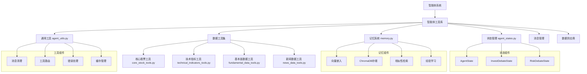

[根目录](../../../../CLAUDE.md) > [tradingagents](../../../CLAUDE.md) > [agents](../../CLAUDE.md) > **utils**

# 智能体工具库 (Agent Utils)

[根目录](../../../../CLAUDE.md) > [tradingagents](../../../CLAUDE.md) > [agents](../../CLAUDE.md) > **utils**

## 模块概述

智能体工具库是 TradingAgents 系统的核心基础设施，提供状态管理、记忆学习、数据工具和通用功能等关键支持。工具库确保智能体间的数据一致性、经验积累和工具可用性，是整个智能体系统运行的技术基础。

## 工具架构



## 核心组件详解

### 1. 状态管理 (agent_states.py)

#### 状态架构设计
状态管理模块定义了整个智能体系统的数据结构和状态传递机制，确保智能体间的信息一致性。

#### 核心状态类

**AgentState - 主状态类**
```python
class AgentState(MessagesState):
    # 基础信息
    company_of_interest: Annotated[str, "Company that we are interested in trading"]
    trade_date: Annotated[str, "What date we are trading at"]
    sender: Annotated[str, "Agent that sent this message"]

    # 分析师报告
    market_report: Annotated[str, "Report from the Market Analyst"]
    sentiment_report: Annotated[str, "Report from the Social Media Analyst"]
    news_report: Annotated[str, "Report from the News Researcher"]
    fundamentals_report: Annotated[str, "Report from the Fundamentals Researcher"]

    # 投资研究阶段
    investment_debate_state: Annotated[InvestDebateState, "Current state of the debate on if to invest or not"]
    investment_plan: Annotated[str, "Plan generated by the Analyst"]
    trader_investment_plan: Annotated[str, "Plan generated by the Trader"]

    # 风险管理阶段
    risk_debate_state: Annotated[RiskDebateState, "Current state of the debate on evaluating risk"]
    final_trade_decision: Annotated[str, "Final decision made by the Risk Analysts"]
```

**InvestDebateState - 投资辩论状态**
```python
class InvestDebateState(TypedDict):
    bull_history: Annotated[str, "Bullish Conversation history"]
    bear_history: Annotated[str, "Bearish Conversation history"]
    history: Annotated[str, "Conversation history"]
    current_response: Annotated[str, "Latest response"]
    judge_decision: Annotated[str, "Final judge decision"]
    count: Annotated[int, "Length of the current conversation"]
```

**RiskDebateState - 风险辩论状态**
```python
class RiskDebateState(TypedDict):
    risky_history: Annotated[str, "Risky Agent's Conversation history"]
    safe_history: Annotated[str, "Safe Agent's Conversation history"]
    neutral_history: Annotated[str, "Neutral Agent's Conversation history"]
    history: Annotated[str, "Conversation history"]
    latest_speaker: Annotated[str, "Analyst that spoke last"]
    current_risky_response: Annotated[str, "Latest response by the risky analyst"]
    current_safe_response: Annotated[str, "Latest response by the safe analyst"]
    current_neutral_response: Annotated[str, "Latest response by the neutral analyst"]
    judge_decision: Annotated[str, "Judge's decision"]
    count: Annotated[int, "Length of the current conversation"]
```

#### 状态设计原则
- **类型安全**：使用 TypedDict 确保类型安全和代码提示
- **注解清晰**：每个字段都有详细的类型注解和说明
- **状态隔离**：不同阶段的状态相互隔离，避免冲突
- **历史追踪**：维护完整的对话历史和决策过程

### 2. 记忆系统 (memory.py)

#### 核心架构
记忆系统基于向量嵌入和 ChromaDB，为智能体提供历史经验学习和检索能力。

#### FinancialSituationMemory 类

**初始化配置**
```python
class FinancialSituationMemory:
    def __init__(self, name, config):
        # 根据后端配置选择嵌入模型
        if config["backend_url"] == "http://localhost:11434/v1":
            self.embedding = "nomic-embed-text"
        else:
            self.embedding = "text-embedding-3-small"

        # 初始化客户端和数据库
        self.client = OpenAI(base_url=config["backend_url"])
        self.chroma_client = chromadb.Client(Settings(allow_reset=True))
        self.situation_collection = self.chroma_client.create_collection(name=name)
```

**核心功能**

**向量嵌入生成**
```python
def get_embedding(self, text):
    """Get OpenAI embedding for a text"""
    response = self.client.embeddings.create(
        model=self.embedding, input=text
    )
    return response.data[0].embedding
```

**经验存储**
```python
def add_situations(self, situations_and_advice):
    """Add financial situations and their corresponding advice"""
    situations = []
    advice = []
    ids = []
    embeddings = []

    offset = self.situation_collection.count()

    for i, (situation, recommendation) in enumerate(situations_and_advice):
        situations.append(situation)
        advice.append(recommendation)
        ids.append(str(offset + i))
        embeddings.append(self.get_embedding(situation))

    self.situation_collection.add(
        documents=situations,
        metadatas=[{"recommendation": rec} for rec in advice],
        embeddings=embeddings,
        ids=ids,
    )
```

**相似性检索**
```python
def get_memories(self, current_situation, n_matches=1):
    """Find matching recommendations using OpenAI embeddings"""
    query_embedding = self.get_embedding(current_situation)

    results = self.situation_collection.query(
        query_embeddings=[query_embedding],
        n_results=n_matches,
        include=["metadatas", "documents", "distances"],
    )

    matched_results = []
    for i in range(len(results["documents"][0])):
        matched_results.append({
            "matched_situation": results["documents"][0][i],
            "recommendation": results["metadatas"][0][i]["recommendation"],
            "similarity_score": 1 - results["distances"][0][i],
        })

    return matched_results
```

#### 记忆学习机制
- **情境匹配**：基于向量嵌入的语义相似性匹配
- **经验积累**：持续积累交易决策经验和教训
- **动态学习**：根据新经验不断优化决策质量
- **多模态支持**：支持不同嵌入模型和数据源

### 3. 通用工具 (agent_utils.py)

#### 核心功能

**消息管理**
```python
def create_msg_delete():
    def delete_messages(state):
        """Clear messages and add placeholder for Anthropic compatibility"""
        messages = state["messages"]

        # Remove all messages
        removal_operations = [RemoveMessage(id=m.id) for m in messages]

        # Add a minimal placeholder message
        placeholder = HumanMessage(content="Continue")

        return {"messages": removal_operations + [placeholder]}

    return delete_messages
```

**数据工具导入**
```python
# 核心股票数据工具
from tradingagents.agents.utils.core_stock_tools import get_stock_data

# 技术指标工具
from tradingagents.agents.utils.technical_indicators_tools import get_indicators

# 基本面数据工具
from tradingagents.agents.utils.fundamental_data_tools import (
    get_fundamentals,
    get_balance_sheet,
    get_cashflow,
    get_income_statement
)

# 新闻数据工具
from tradingagents.agents.utils.news_data_tools import (
    get_news,
    get_insider_sentiment,
    get_insider_transactions,
    get_global_news
)
```

### 4. 数据工具集

#### 核心股票工具 (core_stock_tools.py)
```python
@tool
def get_stock_data(
    symbol: Annotated[str, "ticker symbol of the company"],
    start_date: Annotated[str, "Start date in yyyy-mm-dd format"],
    end_date: Annotated[str, "End date in yyyy-mm-dd format"],
) -> str:
    """
    Retrieve stock price data (OHLCV) for a given ticker symbol.
    Uses the configured core_stock_apis vendor.
    """
    return route_to_vendor("get_stock_data", symbol, start_date, end_date)
```

#### 技术指标工具 (technical_indicators_tools.py)
提供各类技术分析指标的统一接口，支持：
- 移动平均类指标（SMA、EMA）
- 动量指标（RSI、MACD）
- 波动性指标（布林带、ATR）
- 成交量指标（VWMA、OBV）

#### 基本面数据工具 (fundamental_data_tools.py)
提供公司基本面分析的统一接口，支持：
- 财务报表数据（资产负债表、损益表、现金流量表）
- 基本面指标（PE、PB、ROE等）
- 内部人交易信息
- 公司估值数据

#### 新闻数据工具 (news_data_tools.py)
提供新闻和舆情分析的统一接口，支持：
- 公司和行业新闻检索
- 全球宏观经济新闻
- 内部人情绪分析
- 社交媒体舆情数据

## 工具设计模式

### 工厂函数模式
所有智能体都采用工厂函数模式创建：
```python
def create_agent_type(llm, memory=None):
    def agent_node(state):
        # 智能体逻辑实现
        return updated_state
    return agent_node
```

### 统一工具接口
所有数据工具都遵循统一接口：
```python
from langchain_core.tools import tool
from tradingagents.dataflows.interface import route_to_vendor

@tool
def tool_function(parameters) -> str:
    """Tool description with parameter annotations"""
    return route_to_vendor("tool_name", *parameters)
```

### 错误处理机制
- **优雅降级**：工具调用失败时提供合理默认值
- **故障转移**：自动切换到备用数据源
- **重试机制**：网络或临时错误时的自动重试
- **日志记录**：详细的错误日志和调试信息

## 配置和自定义

### 记忆系统配置
```python
memory_config = {
    "collection_name": "financial_situations",
    "embedding_model": "text-embedding-3-small",
    "max_memory_size": 10000,
    "similarity_threshold": 0.7,
    "backend_url": "https://api.openai.com/v1",
}
```

### 状态扩展
```python
# 扩展AgentState以支持新的状态字段
class ExtendedAgentState(AgentState):
    additional_field: Annotated[str, "Additional state information"]
    optional_field: Annotated[Optional[str], "Optional field"] = None
```

### 自定义工具开发
```python
from langchain_core.tools import tool
from tradingagents.dataflows.interface import route_to_vendor

@tool
def custom_analysis_tool(
    symbol: Annotated[str, "Stock symbol"],
    analysis_type: Annotated[str, "Type of analysis"],
) -> str:
    """
    Custom analysis tool for specialized calculations.
    Args:
        symbol: Stock ticker symbol
        analysis_type: Type of analysis to perform
    Returns:
        Analysis results in string format
    """
    return route_to_vendor("custom_analysis", symbol, analysis_type)
```

## 性能优化建议

### 内存优化
1. **向量压缩**：使用高效的向量压缩算法
2. **分层存储**：冷热数据分层存储策略
3. **缓存机制**：常用查询结果的内存缓存
4. **定期清理**：定期清理过期和低质量数据

### 查询优化
1. **索引优化**：优化向量索引和搜索算法
2. **批量处理**：支持批量向量操作和查询
3. **并行计算**：并行处理多个相似性查询
4. **预计算**：预计算常用查询的结果

### 工具性能
1. **连接池**：数据库连接池管理
2. **API缓存**：API调用结果缓存
3. **异步处理**：支持异步工具调用
4. **资源管理**：智能的资源分配和回收

## 常见问题 (FAQ)

### Q: 如何扩展状态管理以支持新的智能体类型？
A: 通过继承现有的状态类或创建新的 TypedDict，并在相关智能体中引用新的状态字段。

### Q: 记忆系统如何处理大规模数据？
A: ChromaDB 支持大规模向量存储，可以通过分片、压缩和分层存储来优化性能。

### Q: 工具调用失败时如何处理？
A: 通过 route_to_vendor 函数的故障转移机制，自动尝试备用的数据供应商。

### Q: 如何确保数据一致性？
A: 通过统一的状态管理和原子性操作，确保智能体间数据传递的一致性。

### Q: 支持哪些类型的嵌入模型？
A: 支持 OpenAI 的 text-embedding-3-small/text-embedding-3-large，以及本地的 nomic-embed-text 等模型。

## 相关文件清单

### 核心工具文件
- `agent_states.py` - 状态管理定义
- `memory.py` - 向量记忆系统
- `agent_utils.py` - 通用工具和消息管理

### 数据工具文件
- `core_stock_tools.py` - 核心股票数据工具
- `technical_indicators_tools.py` - 技术指标工具
- `fundamental_data_tools.py` - 基本面数据工具
- `news_data_tools.py` - 新闻数据工具

### 集成接口
- `../../dataflows/interface.py` - 数据供应商接口
- `../__init__.py` - 工具导出和集成

## 变更记录 (Changelog)

### v1.0.0 (2024-12-20)
- 建立基础状态管理和记忆系统
- 实现统一的数据工具接口
- 集成 ChromaDB 向量存储
- 设计工厂函数模式和错误处理机制

### v1.1.0 (2024-12-20)
- 优化向量嵌入和检索性能
- 改进状态管理的类型安全性
- 增强工具的错误处理和故障转移
- 完善消息管理和资源清理

### 下一步计划
- [ ] 支持更多类型的嵌入模型
- [ ] 实现更高级的记忆学习算法
- [ ] 优化大规模数据处理性能
- [ ] 添加工具性能监控和诊断
- [ ] 支持分布式状态管理

---

智能体工具库通过提供统一的基础设施和工具支持，确保整个智能体系统的高效、可靠和可扩展运行，是 TradingAgents 系统的技术基石。