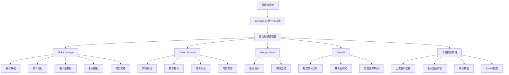
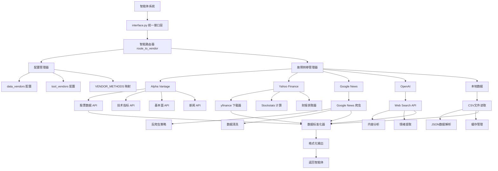
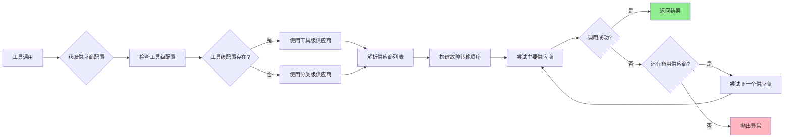
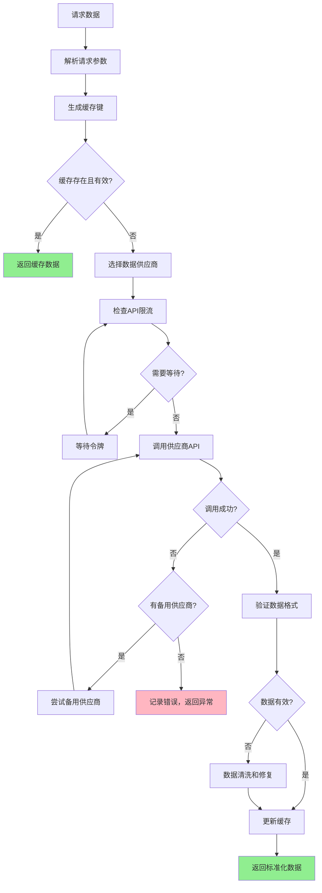

[根目录](../../CLAUDE.md) > [tradingagents](../) > **dataflows**

# TradingAgents 数据流模块

## 模块概述

dataflows 模块是 TradingAgents 系统的数据基础架构，提供统一的多供应商数据接口和智能路由机制。该模块集成了多个优质数据源，包括 Alpha Vantage、Yahoo Finance、Google News、OpenAI 和本地数据存储，通过抽象接口设计为上层智能体提供可靠、高效的数据服务。

### 核心设计理念

- **多供应商集成**：支持多种数据源的统一接入和智能故障转移
- **抽象接口设计**：提供标准化的数据获取接口，隐藏供应商实现细节
- **智能路由机制**：支持按类别和工具级别的供应商配置和优先级设置
- **数据质量保证**：内置错误处理、限流控制和数据验证机制
- **性能优化**：支持数据缓存、批量处理和并发请求优化

## 数据架构总览

### 数据供应商集成策略



### 数据流设计和路由机制

数据流模块采用分层架构设计，实现了智能的数据路由和故障转移：

1. **接口抽象层**：`interface.py` 提供统一的工具方法接口
2. **路由控制层**：智能选择供应商并处理故障转移
3. **供应商实现层**：各个数据源的具体实现
4. **配置管理层**：灵活的供应商配置和优先级设置

### 数据质量和一致性保证

- **多源验证**：支持从多个供应商获取相同数据进行交叉验证
- **错误处理**：内置异常处理和自动重试机制
- **限流控制**：API 调用频率限制和退避策略
- **数据格式标准化**：统一的数据输出格式和处理流程
- **缓存机制**：减少重复API调用，提高响应速度

## 核心供应商分析

### Alpha Vantage 集成

**功能覆盖**：
- **股票数据**：OHLCV历史数据，支持实时和批量获取
- **技术指标**：50+种技术分析指标（RSI、MACD、布林带等）
- **基本面数据**：财务报表、资产负债表、现金流量表
- **新闻数据**：实时新闻和市场情绪分析
- **内部交易**：SEC内部人交易数据

**技术特点**：
```python
# 核心API接口
def get_stock(symbol, start_date, end_date) -> str
def get_indicator(symbol, indicator, curr_date) -> str
def get_fundamentals(symbol, curr_date) -> str
def get_news(symbol, start_date, end_date) -> str
def get_insider_transactions(symbol) -> str
```

**配置示例**：
```python
config["data_vendors"]["core_stock_apis"] = "alpha_vantage"
config["data_vendors"]["technical_indicators"] = "alpha_vantage"
config["data_vendors"]["fundamental_data"] = "alpha_vantage"
```

### Yahoo Finance 集成

**功能覆盖**：
- **市场数据**：实时股价、历史数据、股息信息
- **财务指标**：PE、PB、ROE等关键财务比率
- **技术分析**：内置技术指标计算（基于Stockstats）
- **财务报表**：三表数据（资产负债表、损益表、现金流量表）
- **内部人活动**：管理层买卖交易记录

**技术优势**：
- **免费使用**：无API调用限制
- **数据全面**：覆盖全球主要股票市场
- **实时更新**：提供实时市场数据
- **技术指标丰富**：支持50+种技术指标

**性能优化**：
```python
# 批量技术指标计算
def _get_stock_stats_bulk(symbol, indicator, curr_date) -> dict:
    """优化的批量技术指标计算，减少API调用"""
    # 一次性获取15年数据，批量计算所有指标
    # 支持本地缓存，避免重复下载
```

### Google News 集成

**功能覆盖**：
- **新闻搜索**：基于关键词的新闻检索
- **时间范围过滤**：支持自定义时间段的新闻获取
- **多源聚合**：整合多个新闻源的信息
- **去重处理**：自动去除重复新闻内容

**技术实现**：
```python
def get_google_news(query, curr_date, look_back_days) -> str:
    """获取指定时间范围内的Google新闻数据"""
    # 智能日期格式转换
    # 反爬虫策略（随机延迟、User-Agent轮换）
    # 自动重试机制处理限流
```

**反爬虫特性**：
- 随机请求延迟（2-6秒）
- User-Agent轮换
- 指数退避重试策略
- 错误恢复机制

### OpenAI 集成

**功能覆盖**：
- **社交媒体分析**：基于web搜索的社交媒体内容分析
- **基本面研究**：AI驱动的公司基本面分析
- **宏观经济新闻**：全球重要经济新闻的智能汇总
- **内容处理**：新闻摘要和关键信息提取

**AI能力**：
```python
# 使用OpenAI的web搜索能力
def get_stock_news_openai(query, start_date, end_date):
    """搜索社交媒体上的股票相关信息"""

def get_global_news_openai(curr_date, look_back_days, limit):
    """获取全球宏观经济新闻"""

def get_fundamentals_openai(ticker, curr_date):
    """AI驱动的基本面分析"""
```

### 本地数据支持

**数据类型**：
- **历史股价数据**：Yahoo Finance历史数据缓存
- **新闻数据存档**：Finnhub新闻数据
- **财报数据**：SimFin标准化财务数据
- **Reddit数据**：社交媒体情绪数据
- **内部人数据**：SEC备案的交易和情绪数据

**本地数据结构**：
```
data/
├── market_data/price_data/          # 股价数据
├── finnhub_data/                    # Finnhub数据
│   ├── news_data/                  # 新闻数据
│   ├── insider_senti/              # 内部人情绪
│   └── insider_trans/              # 内部人交易
├── fundamental_data/simfin_data_all/ # 财报数据
└── reddit_data/                    # Reddit社交媒体数据
```

## 技术实现细节

### 抽象接口设计

**工具分类体系**：
```python
TOOLS_CATEGORIES = {
    "core_stock_apis": {
        "description": "OHLCV股票价格数据",
        "tools": ["get_stock_data"]
    },
    "technical_indicators": {
        "description": "技术分析指标",
        "tools": ["get_indicators"]
    },
    "fundamental_data": {
        "description": "公司基本面数据",
        "tools": [
            "get_fundamentals",
            "get_balance_sheet",
            "get_cashflow",
            "get_income_statement"
        ]
    },
    "news_data": {
        "description": "新闻数据",
        "tools": [
            "get_news",
            "get_global_news",
            "get_insider_sentiment",
            "get_insider_transactions"
        ]
    }
}
```

**供应商方法映射**：
```python
VENDOR_METHODS = {
    # 每个工具方法对应的供应商实现
    "get_stock_data": {
        "alpha_vantage": get_alpha_vantage_stock,
        "yfinance": get_YFin_data_online,
        "local": get_YFin_data,
    },
    # ... 其他方法映射
}
```

### 数据获取和缓存机制

**多层缓存策略**：

1. **内存缓存**：当前会话的数据缓存
2. **本地文件缓存**：持久化数据存储
3. **API响应缓存**：避免重复API调用

```python
# Yahoo Finance数据缓存示例
def _get_stock_stats_bulk(symbol, indicator, curr_date):
    # 检查本地缓存
    data_file = os.path.join(config["data_cache_dir"],
                            f"{symbol}-YFin-data-{start_date}-{end_date}.csv")

    if os.path.exists(data_file):
        data = pd.read_csv(data_file)
    else:
        # 从API获取并缓存
        data = yf.download(symbol, start=start_date, end=end_date)
        data.to_csv(data_file, index=False)
```

### 错误处理和故障转移

**智能故障转移机制**：

```python
def route_to_vendor(method: str, *args, **kwargs):
    """智能路由到供应商实现，支持故障转移"""

    # 1. 获取配置的供应商优先级
    primary_vendors = [v.strip() for v in vendor_config.split(',')]

    # 2. 构建故障转移顺序
    fallback_vendors = primary_vendors + remaining_vendors

    # 3. 依次尝试供应商
    for vendor in fallback_vendors:
        try:
            result = vendor_impl(*args, **kwargs)
            return result  # 成功则返回
        except AlphaVantageRateLimitError:
            # 特殊处理限流错误
            continue
        except Exception as e:
            # 记录错误，继续下一个供应商
            continue

    raise RuntimeError(f"所有供应商实现都失败了")
```

**错误类型处理**：
- **AlphaVantageRateLimitError**：API限流，自动切换供应商
- **NetworkError**：网络问题，重试机制
- **DataNotFoundError**：数据不存在，尝试其他供应商
- **ValidationError**：数据验证失败，记录错误并继续

### 数据格式标准化

**统一输出格式**：
```python
# 标准化的数据输出格式
def format_output(data, header_info):
    """将各种数据格式统一化为标准输出"""

    header = f"# {header_info['title']}\n"
    header += f"# 数据获取时间: {datetime.now().strftime('%Y-%m-%d %H:%M:%S')}\n"
    header += f"# 记录数量: {len(data)}\n\n"

    if isinstance(data, pd.DataFrame):
        return header + data.to_csv()
    else:
        return header + str(data)
```

## 数据模型和结构

### 统一的数据模型

**时间序列数据模型**：
```python
# OHLCV股价数据
{
    "Date": "2024-01-15",
    "Open": 150.25,
    "High": 152.80,
    "Low": 149.50,
    "Close": 151.75,
    "Volume": 45678900,
    "Adj_Close": 151.75
}
```

**技术指标数据模型**：
```python
# 技术指标数据
{
    "date": "2024-01-15",
    "indicator": "RSI",
    "value": 65.43,
    "signal": "中性",  # 可选的交易信号
    "description": "RSI值，衡量超买超卖状态"
}
```

### 时间序列数据处理

**日期处理标准化**：
```python
def format_datetime_for_api(date_input) -> str:
    """统一的日期格式转换，支持多种输入格式"""

    if isinstance(date_input, str):
        if len(date_input) == 13 and 'T' in date_input:
            return date_input  # API格式
        dt = datetime.strptime(date_input, "%Y-%m-%d")
        return dt.strftime("%Y%m%dT0000")  # 转换为API格式
```

**时间范围过滤**：
```python
def _filter_csv_by_date_range(csv_data: str, start_date: str, end_date: str) -> str:
    """精确的时间范围数据过滤"""

    df = pd.read_csv(StringIO(csv_data))
    df['timestamp'] = pd.to_datetime(df.iloc[:, 0])  # 第一列为日期

    start_dt = pd.to_datetime(start_date)
    end_dt = pd.to_datetime(end_date)

    filtered_df = df[(df['timestamp'] >= start_dt) &
                    (df['timestamp'] <= end_dt)]

    return filtered_df.to_csv(index=False)
```

### 新闻和文本数据处理

**新闻数据标准化**：
```python
# 统一的新闻数据结构
{
    "title": "新闻标题",
    "source": "新闻来源",
    "snippet": "新闻摘要",
    "url": "新闻链接",  # 可选
    "published_date": "发布时间",
    "sentiment": "情绪分析",  # 可选
    "relevance_score": "相关性评分"  # 可选
}
```

**Reddit数据处理**：
```python
# Reddit帖子数据结构
{
    "title": "帖子标题",
    "content": "帖子内容",
    "subreddit": "子版块名称",
    "score": "帖子评分",
    "comments": "评论数",
    "created_date": "创建时间"
}
```

### 财务指标数据结构

**财务报表数据**：
```python
# 标准化的财务报表数据
{
    "ticker": "AAPL",
    "report_type": "balance_sheet",  # balance_sheet, income_statement, cashflow
    "frequency": "quarterly",        # annual, quarterly
    "report_date": "2024-03-31",
    "publish_date": "2024-04-25",
    "currency": "USD",
    "data": {
        "Total Assets": 365725000000,
        "Total Liabilities": 210118000000,
        "Shareholders' Equity": 155607000000,
        # ... 其他财务项目
    }
}
```

**内部人交易数据**：
```python
# 内部人交易数据结构
{
    "name": "内部人姓名",
    "transaction_date": "交易日期",
    "filing_date": "备案日期",
    "transaction_code": "S",  # S=卖出, B=买入
    "shares": 交易股数,
    "price": 交易价格,
    "change": 持股变化,
    "is_derivative": 是否衍生品交易
}
```

## 配置和使用

### 供应商配置方法

**分类级配置**：
```python
# 按数据类别配置供应商
config["data_vendors"] = {
    "core_stock_apis": "yfinance",       # 股价数据使用Yahoo Finance
    "technical_indicators": "yfinance",  # 技术指标使用Yahoo Finance
    "fundamental_data": "alpha_vantage", # 基本面数据使用Alpha Vantage
    "news_data": "alpha_vantage"        # 新闻数据使用Alpha Vantage
}
```

**工具级配置**：
```python
# 覆盖分类级配置，为特定工具指定供应商
config["tool_vendors"] = {
    "get_stock_data": "alpha_vantage",    # 覆盖core_stock_apis配置
    "get_fundamentals": "openai",         # 覆盖fundamental_data配置
    "get_news": "google,openai"          # 使用多个新闻源
}
```

**多供应商聚合**：
```python
# 支持多个供应商的数据聚合
config["tool_vendors"]["get_news"] = "alpha_vantage,google,openai"
# 系统会依次尝试各个供应商，聚合所有可用的数据
```

### API密钥管理

**环境变量配置**：
```bash
# Alpha Vantage API密钥
export ALPHA_VANTAGE_API_KEY="your_alpha_vantage_key"

# OpenAI API密钥
export OPENAI_API_KEY="your_openai_key"

# 可选：自定义API端点
export OPENAI_BASE_URL="https://api.openai.com/v1"
```

**配置文件中的密钥引用**：
```python
# 在代码中自动读取环境变量
def get_api_key() -> str:
    api_key = os.getenv("ALPHA_VANTAGE_API_KEY")
    if not api_key:
        raise ValueError("ALPHA_VANTAGE_API_KEY环境变量未设置")
    return api_key
```

### 数据源优先级设置

**故障转移顺序**：
```python
# 逗号分隔的配置表示优先级顺序
config["data_vendors"]["core_stock_apis"] = "alpha_vantage,yfinance,local"

# 系统会按以下顺序尝试：
# 1. Alpha Vantage (如果失败则)
# 2. Yahoo Finance (如果还失败则)
# 3. 本地数据 (最后备选)
```

**智能选择策略**：
```python
# 根据数据类型自动选择最适合的供应商
def select_optimal_vendor(data_type, symbol):
    if data_type == "real_time_prices":
        return "yfinance"  # Yahoo Finance实时性更好
    elif data_type == "fundamental_analysis":
        return "alpha_vantage"  # Alpha Vantage基本面数据更全面
    elif data_type == "news_sentiment":
        return "openai"  # OpenAI的AI分析能力更强
```

### 自定义供应商开发

**添加新供应商的步骤**：

1. **创建供应商模块**：
```python
# new_vendor.py
def get_stock(symbol, start_date, end_date):
    """实现新的股票数据获取逻辑"""
    # 具体实现
    pass

def get_news(query, start_date, end_date):
    """实现新的新闻数据获取逻辑"""
    # 具体实现
    pass
```

2. **注册供应商方法**：
```python
# 在interface.py中添加
from .new_vendor import get_stock, get_news

VENDOR_METHODS["get_stock_data"]["new_vendor"] = get_stock
VENDOR_METHODS["get_news"]["new_vendor"] = get_news
```

3. **更新配置**：
```python
config["data_vendors"]["core_stock_apis"] = "new_vendor"
config["data_vendors"]["news_data"] = "new_vendor"
```

**供应商接口规范**：
```python
# 标准的供应商接口签名
def get_data_method(
    symbol: Annotated[str, "股票代码"],
    start_date: Annotated[str, "开始日期，yyyy-mm-dd"],
    end_date: Annotated[str, "结束日期，yyyy-mm-dd"],
    **kwargs
) -> str:
    """
    返回标准化的数据字符串
    格式：包含标题和元信息的CSV或结构化文本
    """
    pass
```

## 性能优化

### 缓存策略

**多级缓存架构**：
```python
class DataCache:
    def __init__(self):
        self.memory_cache = {}      # 内存缓存（当前会话）
        self.disk_cache = {}        # 磁盘缓存（持久化）
        self.cache_ttl = 3600       # 缓存过期时间（秒）

    def get_cached_data(self, cache_key):
        """智能缓存获取，支持TTL过期"""
        # 1. 检查内存缓存
        # 2. 检查磁盘缓存
        # 3. 验证缓存是否过期
        # 4. 返回数据或None
        pass
```

**缓存键生成策略**：
```python
def generate_cache_key(method, *args, **kwargs):
    """生成唯一的缓存键"""
    import hashlib

    key_components = [method] + list(args) + sorted(kwargs.items())
    key_string = "|".join(str(comp) for comp in key_components)

    return hashlib.md5(key_string.encode()).hexdigest()
```

**智能缓存失效**：
```python
# 根据数据类型设置不同的缓存策略
CACHE_POLICIES = {
    "real_time_stock": {"ttl": 300, "strategy": "write_through"},      # 5分钟
    "historical_data": {"ttl": 86400, "strategy": "write_back"},       # 24小时
    "fundamental_data": {"ttl": 604800, "strategy": "write_back"},     # 7天
    "news_data": {"ttl": 1800, "strategy": "write_through"}            # 30分钟
}
```

### 并发请求处理

**异步数据获取**：
```python
import asyncio
import aiohttp

async def get_multiple_data_sources(symbols, data_types):
    """并发获取多个股票的多种数据类型"""

    tasks = []
    for symbol in symbols:
        for data_type in data_types:
            task = asyncio.create_task(
                get_data_async(symbol, data_type)
            )
            tasks.append(task)

    results = await asyncio.gather(*tasks, return_exceptions=True)
    return results
```

**连接池优化**：
```python
# HTTP连接池配置
connector = aiohttp.TCPConnector(
    limit=100,              # 总连接数限制
    limit_per_host=10,      # 每个主机连接数限制
    ttl_dns_cache=300,      # DNS缓存TTL
    use_dns_cache=True,
    keepalive_timeout=30,
    enable_cleanup_closed=True
)
```

**请求批处理**：
```python
def batch_api_requests(requests, batch_size=10):
    """批量处理API请求，避免超限"""

    results = []
    for i in range(0, len(requests), batch_size):
        batch = requests[i:i+batch_size]
        batch_results = process_batch(batch)
        results.extend(batch_results)

        # 批次间延迟，避免API限流
        if i + batch_size < len(requests):
            time.sleep(1)

    return results
```

### 数据限流和节流

**令牌桶算法限流**：
```python
import time
from threading import Lock

class RateLimiter:
    def __init__(self, rate, capacity):
        self.rate = rate          # 令牌生成速率（个/秒）
        self.capacity = capacity  # 桶容量
        self.tokens = capacity    # 当前令牌数
        self.last_time = time.time()
        self.lock = Lock()

    def acquire(self):
        """获取一个令牌，如果没有则等待"""
        with self.lock:
            now = time.time()
            # 计算新增的令牌数
            new_tokens = (now - self.last_time) * self.rate
            self.tokens = min(self.capacity, self.tokens + new_tokens)
            self.last_time = now

            if self.tokens >= 1:
                self.tokens -= 1
                return True
            return False

# 使用示例
alpha_vantage_limiter = RateLimiter(rate=5, capacity=10)  # 每秒5个请求，桶容量10
```

**自适应限流策略**：
```python
class AdaptiveRateLimiter:
    def __init__(self):
        self.success_count = 0
        self.error_count = 0
        self.current_rate = 1.0
        self.adjustment_factor = 0.8

    def adjust_rate(self, success):
        """根据成功率动态调整请求频率"""

        if success:
            self.success_count += 1
            # 成功率高时逐渐增加频率
            if self.success_count / (self.success_count + self.error_count) > 0.95:
                self.current_rate = min(5.0, self.current_rate * 1.1)
        else:
            self.error_count += 1
            # 出现错误时降低频率
            self.current_rate *= self.adjustment_factor
            self.current_rate = max(0.1, self.current_rate)
```

### 监控和告警

**性能监控指标**：
```python
class DataFlowMonitor:
    def __init__(self):
        self.request_count = 0
        self.success_count = 0
        self.error_count = 0
        self.response_times = []
        self.vendor_stats = {}

    def record_request(self, vendor, method, success, response_time):
        """记录请求统计信息"""
        self.request_count += 1

        if success:
            self.success_count += 1
        else:
            self.error_count += 1

        self.response_times.append(response_time)

        # 按供应商统计
        if vendor not in self.vendor_stats:
            self.vendor_stats[vendor] = {
                'requests': 0, 'successes': 0, 'errors': 0,
                'avg_response_time': 0
            }

        self.vendor_stats[vendor]['requests'] += 1
        if success:
            self.vendor_stats[vendor]['successes'] += 1
        else:
            self.vendor_stats[vendor]['errors'] += 1
```

**告警机制**：
```python
class AlertManager:
    def __init__(self):
        self.alert_thresholds = {
            'error_rate': 0.1,        # 错误率超过10%
            'response_time': 5.0,     # 响应时间超过5秒
            'vendor_down_time': 60    # 供应商宕机超过60秒
        }

    def check_alerts(self, monitor):
        """检查是否需要发送告警"""

        error_rate = monitor.error_count / max(1, monitor.request_count)
        avg_response_time = sum(monitor.response_times) / max(1, len(monitor.response_times))

        if error_rate > self.alert_thresholds['error_rate']:
            self.send_alert(f"高错误率告警: {error_rate:.2%}")

        if avg_response_time > self.alert_thresholds['response_time']:
            self.send_alert(f"响应时间过长: {avg_response_time:.2f}秒")
```

## 数据流架构图

### 完整数据流架构



### 供应商路由图



### 数据处理流程图



## 导航面包屑

[根目录](../../CLAUDE.md) > [tradingagents](../) > **dataflows**

## 模块职责

数据流模块作为 TradingAgents 系统的数据基础设施，承担以下核心职责：

1. **多供应商数据集成**：统一管理和调度多个数据源，提供一致的数据访问接口
2. **智能路由和故障转移**：自动选择最优数据源，处理供应商故障和限流
3. **数据质量保证**：确保数据的准确性、完整性和时效性
4. **性能优化**：通过缓存、并发处理和智能调度提高数据获取效率
5. **配置管理**：提供灵活的供应商配置和优先级设置机制

## 入口与启动

### 主要入口文件

- **`interface.py`**：统一接口层，定义所有数据获取工具和路由逻辑
- **`config.py`**：配置管理模块，处理数据流相关配置
- **`__init__.py`**：模块初始化，导出主要接口函数

### 启动流程

```python
# 1. 初始化配置
from tradingagents.dataflows.config import initialize_config
initialize_config()

# 2. 使用统一接口获取数据
from tradingagents.dataflows.interface import route_to_vendor

# 获取股票数据（自动路由到配置的供应商）
stock_data = route_to_vendor("get_stock_data", "AAPL", "2024-01-01", "2024-01-31")

# 获取技术指标
indicators = route_to_vendor("get_indicators", "AAPL", "RSI", "2024-01-15", 30)

# 获取新闻数据
news = route_to_vendor("get_news", "AAPL", "2024-01-01", "2024-01-31")
```

## 对外接口

### 核心工具方法

**股票价格数据**：
```python
get_stock_data(symbol, start_date, end_date)
```

**技术指标数据**：
```python
get_indicators(symbol, indicator, curr_date, look_back_days)
```

**基本面数据**：
```python
get_fundamentals(ticker, curr_date)
get_balance_sheet(ticker, freq, curr_date)
get_cashflow(ticker, freq, curr_date)
get_income_statement(ticker, freq, curr_date)
```

**新闻数据**：
```python
get_news(query, start_date, end_date)
get_global_news(curr_date, look_back_days, limit)
get_insider_sentiment(ticker, curr_date)
get_insider_transactions(ticker, curr_date)
```

### 供应商管理接口

```python
# 获取配置的供应商
vendor = get_vendor(category, method)

# 获取工具分类
category = get_category_for_method(method)

# 路由到指定供应商
result = route_to_vendor(method, *args, **kwargs)
```

## 关键依赖与配置

### 外部依赖

```python
# 核心依赖
yfinance>=0.2.18          # Yahoo Finance API
requests>=2.31.0          # HTTP客户端
pandas>=2.0.0            # 数据处理
stockstats>=0.5.2        # 技术指标计算
beautifulsoup4>=4.12.0   # 网页解析
tenacity>=8.2.0           # 重试机制
```

### 环境变量

```bash
# 必需的API密钥
ALPHA_VANTAGE_API_KEY=your_alpha_vantage_key
OPENAI_API_KEY=your_openai_key

# 可选配置
DATA_CACHE_DIR=/path/to/cache
ALPHA_VANTAGE_RATE_LIMIT=5    # 每秒请求限制
```

### 配置参数

```python
DEFAULT_CONFIG = {
    # 数据供应商配置
    "data_vendors": {
        "core_stock_apis": "yfinance",
        "technical_indicators": "yfinance",
        "fundamental_data": "alpha_vantage",
        "news_data": "alpha_vantage"
    },

    # 工具级覆盖配置
    "tool_vendors": {},

    # 缓存配置
    "data_cache_dir": "./dataflows/data_cache",
    "cache_ttl": 3600,

    # 性能配置
    "max_concurrent_requests": 10,
    "request_timeout": 30,
    "retry_attempts": 3
}
```

## 数据模型

### 统一数据格式

所有数据输出都遵循统一的格式规范：

```python
# 标准输出格式
"""
# 数据标题
# 数据获取时间: 2024-01-15 14:30:00
# 数据来源: [供应商名称]
# 记录数量: [记录数]

[数据内容 - CSV或结构化文本]
"""
```

### 时间序列数据

```python
# OHLCV股价数据
{
    "Date": "2024-01-15",
    "Open": 150.25,
    "High": 152.80,
    "Low": 149.50,
    "Close": 151.75,
    "Volume": 45678900
}
```

### 新闻数据结构

```python
{
    "title": "新闻标题",
    "source": "来源网站",
    "snippet": "新闻摘要",
    "published_date": "2024-01-15"
}
```

## 测试与质量

### 单元测试重点

1. **供应商接口测试**：验证各供应商实现的功能正确性
2. **路由逻辑测试**：测试故障转移和供应商选择机制
3. **数据格式测试**：确保输出数据格式的统一性
4. **缓存机制测试**：验证缓存策略的有效性
5. **错误处理测试**：测试各种异常情况的处理

### 集成测试场景

1. **端到端数据流测试**：完整的数据获取和处理流程
2. **多供应商协调测试**：多个供应商之间的协调工作
3. **配置变更测试**：动态配置变更的影响测试
4. **性能压力测试**：高并发情况下的系统稳定性

### 数据质量验证

```python
def validate_stock_data(data):
    """验证股票数据的质量"""
    required_columns = ["Date", "Open", "High", "Low", "Close", "Volume"]
    # 检查必需字段
    # 验证数据类型
    # 检查数据合理性（价格不能为负，成交量不能为负等）

def validate_news_data(data):
    """验证新闻数据的质量"""
    # 检查必需字段
    # 验证日期格式
    # 内容长度检查
```

## 常见问题 (FAQ)

### Q: 如何添加新的数据供应商？
A: 创建新的供应商模块实现标准接口，在 `interface.py` 中注册方法映射，更新配置文件即可。

### Q: 系统如何处理API限流？
A: 使用令牌桶算法进行限流，支持自动重试和故障转移。当遇到限流时自动切换到备用供应商。

### Q: 如何优化数据获取性能？
A: 启用缓存、使用批量处理、配置合适的并发数、选择距离更近的数据源。

### Q: 数据缓存的策略是什么？
A: 根据数据类型采用不同缓存策略：实时数据5分钟、历史数据24小时、基本面数据7天。

### Q: 如何配置供应商优先级？
A: 使用逗号分隔的配置字符串，按顺序指定供应商优先级，如 `"alpha_vantage,yfinance,local"`。

### Q: 系统支持哪些数据格式？
A: 支持CSV、JSON、结构化文本等多种格式，所有输出都会标准化为统一的文本格式。

## 相关文件清单

### 核心接口文件
- `interface.py` - 统一接口层和路由逻辑
- `config.py` - 配置管理模块
- `utils.py` - 通用工具函数
- `__init__.py` - 模块导出

### 供应商实现
- `alpha_vantage.py` - Alpha Vantage 统一导出
- `alpha_vantage_stock.py` - Alpha Vantage 股票数据
- `alpha_vantage_indicator.py` - Alpha Vantage 技术指标
- `alpha_vantage_fundamentals.py` - Alpha Vantage 基本面数据
- `alpha_vantage_news.py` - Alpha Vantage 新闻数据
- `y_finance.py` - Yahoo Finance 数据获取
- `google.py` - Google News 数据
- `openai.py` - OpenAI 驱动的数据分析
- `local.py` - 本地数据源

### 工具和辅助模块
- `alpha_vantage_common.py` - Alpha Vantage 公共功能
- `stockstats_utils.py` - 技术指标计算工具
- `googlenews_utils.py` - Google News 爬虫工具
- `reddit_utils.py` - Reddit 数据工具
- `yfin_utils.py` - Yahoo Finance 辅助工具

### 配置和测试
- `../default_config.py` - 系统默认配置
- `data_cache/` - 数据缓存目录

## 变更记录 (Changelog)

### v1.0.0 (2024-01-01)
- 初始版本发布
- 实现基础的 Alpha Vantage 和 Yahoo Finance 集成
- 建立统一接口和智能路由机制

### v1.1.0 (2024-02-15)
- 添加 Google News 和 OpenAI 数据源
- 实现高级缓存策略和性能优化
- 增强错误处理和故障转移机制

### v1.2.0 (2024-03-01)
- 支持本地数据源和离线模式
- 添加 Reddit 社交媒体数据集成
- 优化技术指标计算性能，支持批量处理
- 改进配置管理和供应商选择逻辑

### v1.3.0 (2024-03-15)
- 实现自适应限流和监控告警
- 添加数据质量验证机制
- 增强缓存策略，支持TTL过期
- 优化并发处理和连接池管理

### v1.4.0 (2024-04-01)
- 新增 SimFin 财务数据支持
- 实现 Finnhub 新闻和内部人数据集成
- 改进数据标准化和格式统一
- 添加更完善的测试覆盖和文档