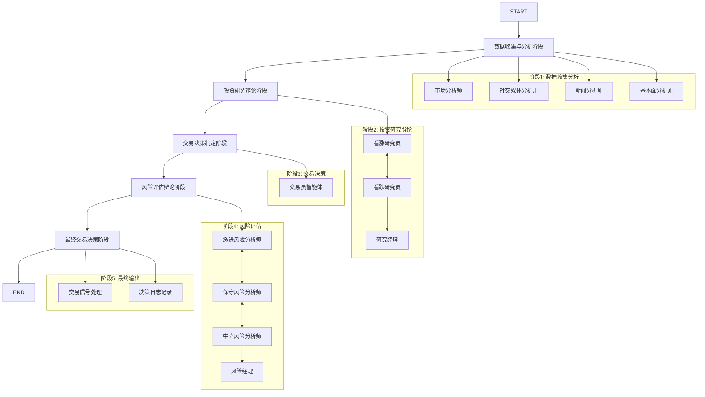
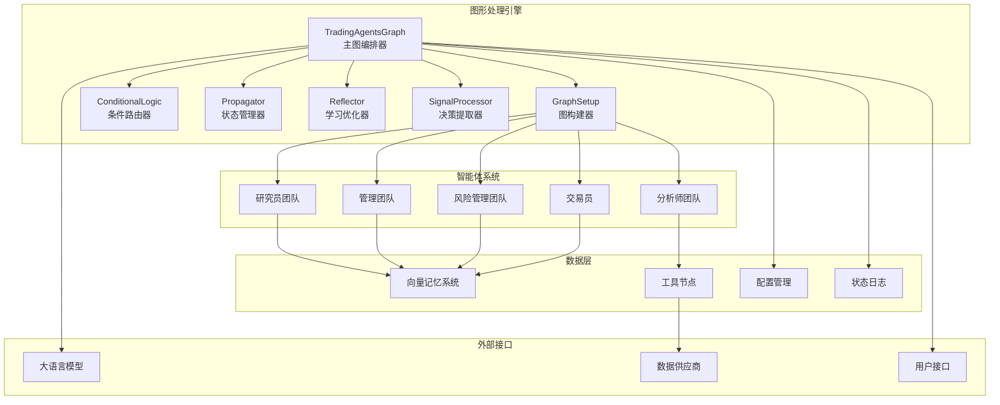
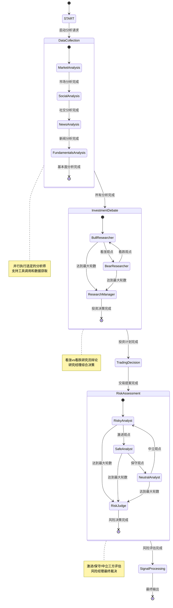
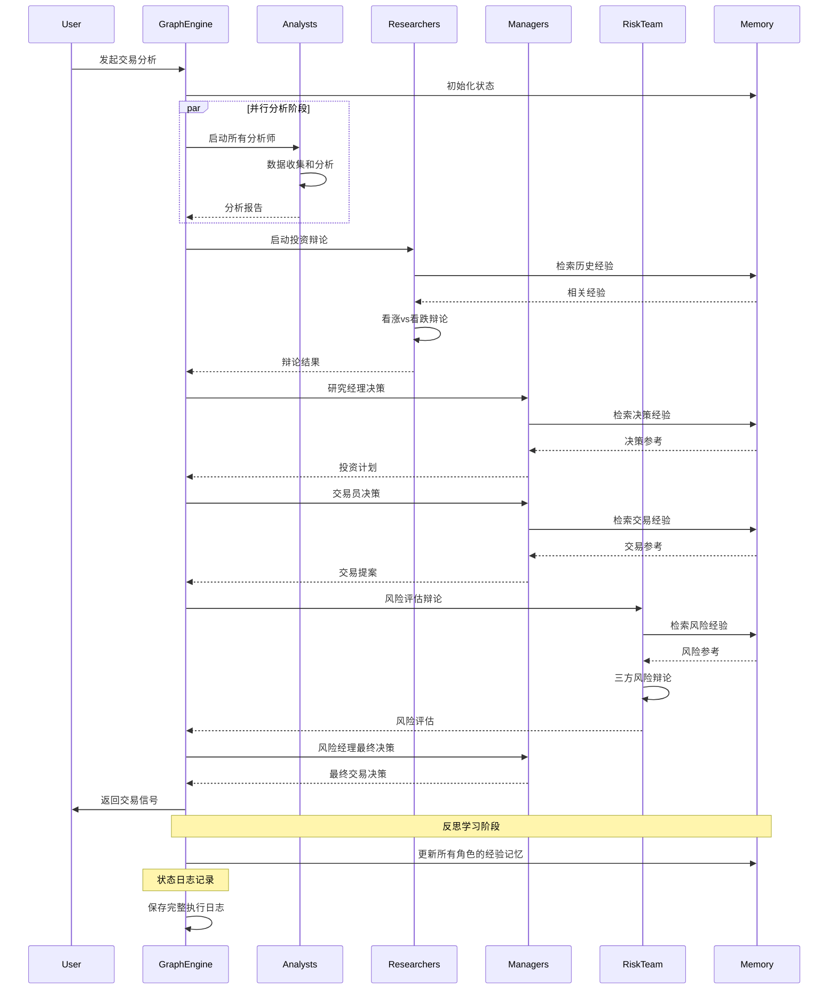

[根目录](../../../CLAUDE.md) > [tradingagents](../../CLAUDE.md) > **graph**

# TradingAgents 图形处理工作流引擎

## 模块概述

Graph 模块是 TradingAgents 系统的核心决策流程引擎，基于 LangGraph 框架构建了一个复杂的多智能体协作工作流。该模块通过状态图、条件路由和智能体协调机制，将市场分析、投资辩论、风险评估和交易执行有机地整合在一个统一的决策流程中，实现了从数据收集到最终交易决策的全自动化智能决策过程。

### 核心设计理念

- **状态驱动架构**：基于 LangGraph 的状态图模型，确保工作流的可预测性和可控性
- **智能体编排**：精细化的智能体节点管理和协作机制
- **条件路由决策**：基于状态和结果的动态工作流分支控制
- **经验学习循环**：集成的反思和记忆系统实现持续学习优化
- **模块化设计**：高度模块化的组件设计，支持灵活配置和扩展

## 图形处理架构总览

### LangGraph 工作流设计理念

本模块采用 LangGraph 的状态图（StateGraph）模式，将复杂的交易决策过程分解为一系列明确定义的节点和边。每个节点代表一个智能体的特定任务，边则定义了状态转换的条件和流程。

#### 状态图核心特征
- **有向无环图结构**：确保工作流的单向性和无死循环
- **状态持久化**：每个节点的输出都会更新全局状态
- **条件分支**：支持基于状态的动态路由决策
- **并发控制**：支持并行节点的并发执行

### 工作流程编排



### 智能体协调机制

#### 协调策略
1. **顺序执行**：分析师团队按配置顺序执行
2. **并行处理**：同一阶段内的分析师可以并行工作
3. **辩论轮换**：研究员和风险分析师按预设规则轮换发言
4. **经理裁决**：研究经理和风险经理负责最终决策

#### 状态传播机制
- **全局状态**：AgentState 作为单一数据源在智能体间传递
- **增量更新**：每个智能体只更新自己负责的状态字段
- **历史维护**：保留完整的决策历史和辩论过程
- **错误隔离**：单个智能体的错误不会影响整个流程

## 核心组件分析

### 1. TradingAgentsGraph - 主图编排器

**文件**: `trading_graph.py`

#### 核心职责
TradingAgentsGraph 是整个系统的主控制器，负责初始化所有组件、构建工作流图，并提供执行接口。

#### 关键特性

**多 LLM 支持**
```python
# 支持多种 LLM 提供商
if self.config["llm_provider"].lower() == "openai":
    self.deep_thinking_llm = ChatOpenAI(model=self.config["deep_think_llm"])
    self.quick_thinking_llm = ChatOpenAI(model=self.config["quick_think_llm"])
elif self.config["llm_provider"].lower() == "anthropic":
    self.deep_thinking_llm = ChatAnthropic(model=self.config["deep_think_llm"])
    self.quick_thinking_llm = ChatAnthropic(model=self.config["quick_think_llm"])
```

**内存管理系统**
```python
# 为每个角色分配独立的记忆空间
self.bull_memory = FinancialSituationMemory("bull_memory", self.config)
self.bear_memory = FinancialSituationMemory("bear_memory", self.config)
self.trader_memory = FinancialSituationMemory("trader_memory", self.config)
self.invest_judge_memory = FinancialSituationMemory("invest_judge_memory", self.config)
self.risk_manager_memory = FinancialSituationMemory("risk_manager_memory", self.config)
```

**工具节点架构**
```python
def _create_tool_nodes(self) -> Dict[str, ToolNode]:
    """为不同数据源创建专门的工具节点"""
    return {
        "market": ToolNode([get_stock_data, get_indicators]),
        "social": ToolNode([get_news]),
        "news": ToolNode([get_news, get_global_news, get_insider_sentiment, get_insider_transactions]),
        "fundamentals": ToolNode([get_fundamentals, get_balance_sheet, get_cashflow, get_income_statement]),
    }
```

#### 执行流程

**主执行方法**
```python
def propagate(self, company_name, trade_date):
    """执行完整的交易分析工作流"""
    # 1. 初始化状态
    init_agent_state = self.propagator.create_initial_state(company_name, trade_date)

    # 2. 执行图流程
    final_state = self.graph.invoke(init_agent_state, **self.propagator.get_graph_args())

    # 3. 存储当前状态用于反思
    self.curr_state = final_state

    # 4. 记录完整状态日志
    self._log_state(trade_date, final_state)

    # 5. 返回决策和处理后的信号
    return final_state, self.process_signal(final_state["final_trade_decision"])
```

**反思学习机制**
```python
def reflect_and_remember(self, returns_losses):
    """基于交易结果进行反思并更新记忆"""
    self.reflector.reflect_bull_researcher(self.curr_state, returns_losses, self.bull_memory)
    self.reflector.reflect_bear_researcher(self.curr_state, returns_losses, self.bear_memory)
    self.reflector.reflect_trader(self.curr_state, returns_losses, self.trader_memory)
    self.reflector.reflect_invest_judge(self.curr_state, returns_losses, self.invest_judge_memory)
    self.reflector.reflect_risk_manager(self.curr_state, returns_losses, self.risk_manager_memory)
```

### 2. GraphSetup - 图构建器

**文件**: `setup.py`

#### 核心职责
GraphSetup 负责根据配置动态构建 LangGraph 工作流图，设置节点、边和条件路由。

#### 智能体节点构建

**动态分析师配置**
```python
def setup_graph(self, selected_analysts=["market", "social", "news", "fundamentals"]):
    """根据选定分析师动态构建工作流图"""
    # 创建分析师节点
    analyst_nodes = {}
    delete_nodes = {}
    tool_nodes = {}

    # 根据配置动态创建节点
    if "market" in selected_analysts:
        analyst_nodes["market"] = create_market_analyst(self.quick_thinking_llm)
        delete_nodes["market"] = create_msg_delete()
        tool_nodes["market"] = self.tool_nodes["market"]

    # ... 其他分析师的动态配置
```

**工作流连接策略**
```python
# 顺序连接分析师
for i, analyst_type in enumerate(selected_analysts):
    current_analyst = f"{analyst_type.capitalize()} Analyst"
    current_tools = f"tools_{analyst_type}"
    current_clear = f"Msg Clear {analyst_type.capitalize()}"

    # 添加条件边
    workflow.add_conditional_edges(
        current_analyst,
        getattr(self.conditional_logic, f"should_continue_{analyst_type}"),
        [current_tools, current_clear],
    )
    workflow.add_edge(current_tools, current_analyst)

    # 连接到下一个分析师或研究员
    if i < len(selected_analysts) - 1:
        next_analyst = f"{selected_analysts[i+1].capitalize()} Analyst"
        workflow.add_edge(current_clear, next_analyst)
    else:
        workflow.add_edge(current_clear, "Bull Researcher")
```

#### 辩论机制构建

**投资辩论连接**
```python
# 看涨/看跌辩论循环
workflow.add_conditional_edges(
    "Bull Researcher",
    self.conditional_logic.should_continue_debate,
    {
        "Bear Researcher": "Bear Researcher",
        "Research Manager": "Research Manager",
    },
)
workflow.add_conditional_edges(
    "Bear Researcher",
    self.conditional_logic.should_continue_debate,
    {
        "Bull Researcher": "Bull Researcher",
        "Research Manager": "Research Manager",
    },
)
```

**风险评估辩论**
```python
# 三方风险分析师轮换
workflow.add_conditional_edges(
    "Risky Analyst",
    self.conditional_logic.should_continue_risk_analysis,
    {
        "Safe Analyst": "Safe Analyst",
        "Risk Judge": "Risk Judge",
    },
)
workflow.add_conditional_edges(
    "Safe Analyst",
    self.conditional_logic.should_continue_risk_analysis,
    {
        "Neutral Analyst": "Neutral Analyst",
        "Risk Judge": "Risk Judge",
    },
)
workflow.add_conditional_edges(
    "Neutral Analyst",
    self.conditional_logic.should_continue_risk_analysis,
    {
        "Risky Analyst": "Risky Analyst",
        "Risk Judge": "Risk Judge",
    },
)
```

### 3. ConditionalLogic - 条件路由器

**文件**: `conditional_logic.py`

#### 核心职责
ConditionalLogic 负责工作流中的条件路由决策，根据当前状态决定下一步的流向。

#### 工具调用判断

**分析师工具调用逻辑**
```python
def should_continue_market(self, state: AgentState):
    """判断市场分析师是否需要继续工具调用"""
    messages = state["messages"]
    last_message = messages[-1]
    if last_message.tool_calls:
        return "tools_market"
    return "Msg Clear Market"

def should_continue_social(self, state: AgentState):
    """判断社交媒体分析师是否需要继续工具调用"""
    messages = state["messages"]
    last_message = messages[-1]
    if last_message.tool_calls:
        return "tools_social"
    return "Msg Clear Social"
```

#### 辩论控制逻辑

**投资辩论轮换**
```python
def should_continue_debate(self, state: AgentState) -> str:
    """控制投资辩论的轮换和终止"""
    if state["investment_debate_state"]["count"] >= 2 * self.max_debate_rounds:
        return "Research Manager"
    if state["investment_debate_state"]["current_response"].startswith("Bull"):
        return "Bear Researcher"
    return "Bull Researcher"
```

**风险评估轮换**
```python
def should_continue_risk_analysis(self, state: AgentState) -> str:
    """控制风险评估的轮换和终止"""
    if state["risk_debate_state"]["count"] >= 3 * self.max_risk_discuss_rounds:
        return "Risk Judge"
    if state["risk_debate_state"]["latest_speaker"].startswith("Risky"):
        return "Safe Analyst"
    if state["risk_debate_state"]["latest_speaker"].startswith("Safe"):
        return "Neutral Analyst"
    return "Risky Analyst"
```

### 4. Propagator - 状态管理器

**文件**: `propagation.py`

#### 核心职责
Propagator 负责状态初始化和图执行参数配置，确保工作流有正确的初始状态和执行环境。

#### 状态初始化

**完整状态构建**
```python
def create_initial_state(self, company_name: str, trade_date: str) -> Dict[str, Any]:
    """创建智能体图的初始状态"""
    return {
        "messages": [("human", company_name)],
        "company_of_interest": company_name,
        "trade_date": str(trade_date),
        "investment_debate_state": InvestDebateState({
            "history": "", "current_response": "", "count": 0
        }),
        "risk_debate_state": RiskDebateState({
            "history": "",
            "current_risky_response": "",
            "current_safe_response": "",
            "current_neutral_response": "",
            "count": 0,
        }),
        "market_report": "",
        "fundamentals_report": "",
        "sentiment_report": "",
        "news_report": "",
    }
```

**图执行参数**
```python
def get_graph_args(self) -> Dict[str, Any]:
    """获取图执行的参数配置"""
    return {
        "stream_mode": "values",
        "config": {"recursion_limit": self.max_recur_limit},
    }
```

### 5. Reflector - 学习优化器

**文件**: `reflection.py`

#### 核心职责
Reflector 实现系统的反思学习机制，通过分析历史决策结果来优化智能体的未来表现。

#### 反思框架

**系统反思提示**
```python
def _get_reflection_prompt(self) -> str:
    return """
    You are an expert financial analyst tasked with reviewing trading decisions/analysis
    and providing a comprehensive, step-by-step analysis.

    1. Reasoning: 分析决策正确性，考虑市场情报、技术指标、价格走势、新闻、情绪和基本面因素
    2. Improvement: 对错误决策提出改进建议和具体修正方案
    3. Summary: 总结经验教训，提取可用于未来交易场景的关键洞察
    4. Query: 将核心经验提炼为不超过1000个token的精炼句子
    """
```

**组件反思机制**
```python
def reflect_bull_researcher(self, current_state, returns_losses, bull_memory):
    """对看涨研究员的分析进行反思并更新记忆"""
    situation = self._extract_current_situation(current_state)
    bull_debate_history = current_state["investment_debate_state"]["bull_history"]

    result = self._reflect_on_component("BULL", bull_debate_history, situation, returns_losses)
    bull_memory.add_situations([(situation, result)])

def reflect_trader(self, current_state, returns_losses, trader_memory):
    """对交易员决策进行反思并更新记忆"""
    situation = self._extract_current_situation(current_state)
    trader_decision = current_state["trader_investment_plan"]

    result = self._reflect_on_component("TRADER", trader_decision, situation, returns_losses)
    trader_memory.add_situations([(situation, result)])
```

### 6. SignalProcessor - 决策提取器

**文件**: `signal_processing.py`

#### 核心职责
SignalProcessor 负责从复杂的分析报告中提取明确的交易决策信号。

#### 信号处理逻辑

**决策提取**
```python
def process_signal(self, full_signal: str) -> str:
    """
    从完整的交易信号中提取核心决策
    返回: BUY, SELL, 或 HOLD
    """
    messages = [
        ("system", "从分析师报告中提取明确的投资决策：SELL, BUY, 或 HOLD。只输出提取的决策，不添加任何额外文本。"),
        ("human", full_signal),
    ]
    return self.quick_thinking_llm.invoke(messages).content
```

## 工作流程设计

### 6个主要阶段的详细流程

#### 阶段1: 数据收集与分析

**执行顺序**
1. **市场分析师**：技术分析和价格趋势识别
2. **社交媒体分析师**：舆情和情绪监控
3. **新闻分析师**：宏观新闻和事件影响评估
4. **基本面分析师**：财务健康度和估值分析

**工具调用模式**
```python
# 每个分析师都可以调用专门的工具节点
workflow.add_conditional_edges(
    "Market Analyst",
    self.conditional_logic.should_continue_market,
    ["tools_market", "Msg Clear Market"],
)
```

**状态更新**
- 每个分析师生成对应的分析报告
- 报告存储在 AgentState 的相应字段中
- 支持工具调用链式反应和多次数据获取

#### 阶段2: 投资研究辩论

**辩论流程**
1. **看涨研究员**：基于分析报告论证买入理由
2. **看跌研究员**：提出反驳观点和风险因素
3. **轮换辩论**：在配置的轮数内持续辩论
4. **研究经理**：综合辩论结果制定投资计划

**状态管理**
```python
investment_debate_state = {
    "bull_history": "看涨观点历史记录",
    "bear_history": "看跌观点历史记录",
    "history": "完整辩论历史",
    "current_response": "当前响应",
    "judge_decision": "法官决策",
    "count": "辩论轮次计数"
}
```

**决策输出**
- 明确的投资建议（买入/持有/卖出）
- 详细的理由和证据支持
- 为交易员提供执行指导

#### 阶段3: 交易决策制定

**交易员角色**
- 分析研究经理的投资计划
- 结合各分析师的报告
- 检索历史交易经验
- 输出具体的交易提案

**输出格式要求**
```
FINAL TRANSACTION PROPOSAL: **BUY/HOLD/SELL**
```

**学习机制**
- 基于向量记忆检索相似历史情况
- 从成功和失败案例中学习
- 避免重复历史错误

#### 阶段4: 风险评估辩论

**三方风险评估**
1. **激进风险分析师**：强调高收益机会
2. **保守风险分析师**：重视风险控制
3. **中立风险分析师**：平衡风险收益

**轮换机制**
```python
def should_continue_risk_analysis(self, state: AgentState) -> str:
    if state["risk_debate_state"]["latest_speaker"].startswith("Risky"):
        return "Safe Analyst"
    if state["risk_debate_state"]["latest_speaker"].startswith("Safe"):
        return "Neutral Analyst"
    return "Risky Analyst"
```

**风险状态管理**
```python
risk_debate_state = {
    "risky_history": "激进观点历史",
    "safe_history": "保守观点历史",
    "neutral_history": "中立观点历史",
    "latest_speaker": "最新发言者",
    "current_risky_response": "激进分析师当前回应",
    "current_safe_response": "保守分析师当前回应",
    "current_neutral_response": "中立分析师当前回应",
    "judge_decision": "风险经理最终决策",
    "count": "讨论轮次计数"
}
```

#### 阶段5: 最终交易决策

**风险经理职责**
- 评估三方风险分析师的观点
- 基于交易员提案进行风险调整
- 整合历史风险管理经验
- 输出最终的风险调整后决策

#### 阶段6: 结果处理与学习

**信号处理**
- 提取明确的交易信号（BUY/SELL/HOLD）
- 记录完整的决策过程和结果
- 为后续回测和分析提供数据

**状态日志记录**
```python
def _log_state(self, trade_date, final_state):
    """记录完整状态到JSON文件"""
    self.log_states_dict[str(trade_date)] = {
        "company_of_interest": final_state["company_of_interest"],
        "trade_date": final_state["trade_date"],
        "market_report": final_state["market_report"],
        # ... 完整的状态记录
        "final_trade_decision": final_state["final_trade_decision"],
    }
```

### 智能体协作模式

#### 辩论式协作
- **对立观点**：通过看涨vs看跌、激进vs保守的对立观点提高决策质量
- **证据驱动**：每个观点都需要基于数据和事实支撑
- **历史学习**：利用记忆系统检索相关历史经验

#### 层次化决策
- **专业分工**：每个智能体专注于特定领域
- **逐级综合**：从专业分析到综合决策的层次化处理
- **权责明确**：每个角色都有明确的职责和决策范围

#### 反馈学习
- **结果反馈**：基于实际交易结果进行反思
- **经验积累**：将决策经验存储到向量记忆中
- **持续优化**：通过学习不断提高决策质量

### 数据传递和状态更新

#### 状态传播模式
```python
# 状态在智能体间传递的典型模式
def agent_node(state):
    # 1. 读取相关状态
    current_data = state["relevant_field"]

    # 2. 执行分析或决策
    analysis_result = perform_analysis(current_data)

    # 3. 更新状态
    return {"updated_field": analysis_result}
```

#### 状态一致性保证
- **原子性更新**：每个智能体的状态更新是原子的
- **版本控制**：维护状态变更的完整历史
- **冲突解决**：通过预定义的规则解决状态冲突

### 错误处理和回滚机制

#### 错误处理策略
1. **优雅降级**：智能体失败时提供合理的默认行为
2. **故障隔离**：单个智能体错误不影响整个流程
3. **重试机制**：对于临时错误支持自动重试
4. **日志记录**：详细记录错误信息用于调试

#### 回滚机制
```python
# 支持状态回滚到关键检查点
checkpoint_states = {
    "after_analysis": analysis_complete_state,
    "after_debate": debate_complete_state,
    "after_risk_assessment": risk_assessment_complete_state,
}
```

## 技术实现细节

### LangGraph 配置和使用

#### 状态图构建
```python
# 创建状态图
workflow = StateGraph(AgentState)

# 添加节点
workflow.add_node("Market Analyst", market_analyst_node)
workflow.add_node("tools_market", tool_nodes["market"])

# 添加边（普通边和条件边）
workflow.add_edge("tools_market", "Market Analyst")
workflow.add_conditional_edges(
    "Market Analyst",
    conditional_logic.should_continue_market,
    ["tools_market", "Msg Clear Market"]
)

# 编译图
app = workflow.compile()
```

#### 流执行模式
```python
# 流式执行（调试模式）
for chunk in app.stream(initial_state, config):
    print(chunk)

# 一次性执行（生产模式）
final_state = app.invoke(initial_state, config)
```

### 图构建算法

#### 动态节点连接
```python
def connect_analysts_sequentially(workflow, selected_analysts):
    """按顺序连接分析师节点"""
    for i, analyst in enumerate(selected_analysts):
        if i == 0:
            workflow.add_edge(START, f"{analyst.capitalize()} Analyst")
        else:
            prev_analyst = f"{selected_analysts[i-1].capitalize()} Analyst"
            current_analyst = f"{analyst.capitalize()} Analyst"
            workflow.add_edge(f"Msg Clear {prev_analyst}", current_analyst)
```

#### 条件路由优化
```python
# 使用方法引用优化条件路由
conditional_method = getattr(self.conditional_logic, f"should_continue_{analyst_type}")
workflow.add_conditional_edges(
    node_name,
    conditional_method,
    routing_mapping
)
```

### 状态管理和持久化

#### 状态序列化
```python
# 支持状态的JSON序列化和持久化
import json
from datetime import datetime

def save_state_to_file(state, filename):
    """将状态保存到JSON文件"""
    state_copy = serialize_state_for_json(state)
    with open(filename, 'w') as f:
        json.dump(state_copy, f, indent=2, default=str)
```

#### 状态恢复机制
```python
def load_state_from_file(filename):
    """从JSON文件恢复状态"""
    with open(filename, 'r') as f:
        state_data = json.load(f)
    return deserialize_state_from_json(state_data)
```

### 内存管理优化

#### 内存使用监控
```python
import psutil
import gc

def monitor_memory_usage():
    """监控内存使用情况"""
    process = psutil.Process()
    memory_info = process.memory_info()
    print(f"内存使用: {memory_info.rss / 1024 / 1024:.2f} MB")

def optimize_memory():
    """优化内存使用"""
    gc.collect()  # 强制垃圾回收
```

#### 缓存策略
```python
from functools import lru_cache

@lru_cache(maxsize=128)
def cached_llm_call(prompt_hash, model_config):
    """缓存LLM调用结果"""
    return make_llm_call(prompt_hash, model_config)
```

## 集成和扩展

### 与智能体系统的集成

#### 智能体工厂集成
```python
# 与agents模块的无缝集成
from tradingagents.agents import (
    create_market_analyst,
    create_bull_researcher,
    create_trader,
    # ... 其他智能体
)

# 动态创建智能体节点
analyst_node = create_market_analyst(self.quick_thinking_llm)
workflow.add_node("Market Analyst", analyst_node)
```

#### 状态系统集成
```python
# 使用agents.utils中定义的状态类
from tradingagents.agents.utils.agent_states import (
    AgentState,
    InvestDebateState,
    RiskDebateState,
)

# 创建状态图时指定状态类型
workflow = StateGraph(AgentState)
```

### 自定义节点开发

#### 自定义智能体节点模板
```python
def create_custom_node(llm, memory=None, tools=None):
    """自定义智能体节点创建模板"""
    def custom_node(state):
        # 1. 提取相关状态信息
        context = extract_context(state)

        # 2. 检索相关记忆（可选）
        if memory:
            memories = memory.get_memories(context)
            context += f"\n历史经验: {memories}"

        # 3. 调用LLM处理
        prompt = build_prompt(context, tools)
        result = llm.invoke(prompt)

        # 4. 处理工具调用（如果有）
        if tools and result.tool_calls:
            tool_results = execute_tools(result.tool_calls, tools)
            result = incorporate_tool_results(result, tool_results)

        # 5. 返回状态更新
        return {"custom_field": result.content}

    return custom_node
```

#### 集成自定义工具
```python
# 在GraphSetup中集成自定义工具节点
def setup_custom_graph(self, custom_tools):
    """设置包含自定义工具的图"""
    custom_tool_node = ToolNode(custom_tools)
    workflow.add_node("custom_tools", custom_tool_node)

    # 添加条件边
    workflow.add_conditional_edges(
        "Custom Analyst",
        self.should_continue_custom,
        ["custom_tools", "Next Node"]
    )
```

### 工作流模板和复用

#### 预定义工作流模板
```python
WORKFLOW_TEMPLATES = {
    "conservative": {
        "selected_analysts": ["fundamentals", "news"],
        "max_debate_rounds": 2,
        "max_risk_discuss_rounds": 3,
    },
    "aggressive": {
        "selected_analysts": ["market", "social", "news"],
        "max_debate_rounds": 1,
        "max_risk_discuss_rounds": 1,
    },
    "balanced": {
        "selected_analysts": ["market", "news", "fundamentals"],
        "max_debate_rounds": 1,
        "max_risk_discuss_rounds": 2,
    }
}

def create_template_graph(template_name):
    """基于预定义模板创建图"""
    template_config = WORKFLOW_TEMPLATES[template_name]
    return TradingAgentsGraph(
        selected_analysts=template_config["selected_analysts"],
        max_debate_rounds=template_config["max_debate_rounds"],
        max_risk_discuss_rounds=template_config["max_risk_discuss_rounds"]
    )
```

#### 工作流组合
```python
class CompositeTradingGraph:
    """组合多个工作流的复合图"""
    def __init__(self, sub_graphs):
        self.sub_graphs = sub_graphs

    def execute_composite_workflow(self, initial_state):
        """执行复合工作流"""
        results = {}
        for graph_name, graph in self.sub_graphs.items():
            results[graph_name] = graph.propagate(
                initial_state["company_name"],
                initial_state["trade_date"]
            )
        return self.combine_results(results)
```

### 监控和调试

#### 执行监控
```python
class GraphMonitor:
    """图执行监控器"""
    def __init__(self):
        self.execution_log = []
        self.performance_metrics = {}

    def log_node_execution(self, node_name, execution_time, input_state, output_state):
        """记录节点执行情况"""
        self.execution_log.append({
            "node": node_name,
            "execution_time": execution_time,
            "input_size": len(str(input_state)),
            "output_size": len(str(output_state)),
            "timestamp": datetime.now()
        })

    def generate_performance_report(self):
        """生成性能报告"""
        total_time = sum(log["execution_time"] for log in self.execution_log)
        return {
            "total_execution_time": total_time,
            "node_performance": self.calculate_node_performance(),
            "bottlenecks": self.identify_bottlenecks()
        }
```

#### 调试工具
```python
def debug_graph_execution(graph, initial_state):
    """调试图执行过程"""
    print("=== 开始调试图执行 ===")

    for i, chunk in enumerate(graph.stream(initial_state)):
        print(f"\n--- 步骤 {i+1} ---")
        for node_name, node_output in chunk.items():
            print(f"节点: {node_name}")
            print(f"输出类型: {type(node_output)}")
            if hasattr(node_output, 'content'):
                print(f"内容预览: {node_output.content[:200]}...")

    print("=== 图执行完成 ===")
```

## 配置和优化

### 图配置参数

#### 核心配置选项
```python
graph_config = {
    # 智能体选择
    "selected_analysts": ["market", "social", "news", "fundamentals"],

    # 辩论控制
    "max_debate_rounds": 1,  # 投资辩论最大轮数
    "max_risk_discuss_rounds": 1,  # 风险讨论最大轮数

    # 图执行控制
    "max_recur_limit": 100,  # 最大递归限制

    # 调试模式
    "debug_mode": False,  # 是否启用调试输出

    # 性能控制
    "parallel_analysts": True,  # 是否并行执行分析师
    "cache_llm_calls": True,  # 是否缓存LLM调用
}
```

#### 高级配置
```python
advanced_config = {
    # 条件逻辑配置
    "conditional_logic": {
        "enable_smart_routing": True,  # 启用智能路由
        "adaptive_debate_rounds": True,  # 自适应辩论轮数
        "early_termination_threshold": 0.95,  # 早期终止置信度阈值
    },

    # 记忆系统配置
    "memory_config": {
        "max_memory_size": 10000,  # 最大记忆条目数
        "similarity_threshold": 0.8,  # 相似性阈值
        "auto_cleanup": True,  # 自动清理过期记忆
    },

    # 错误处理配置
    "error_handling": {
        "max_retries": 3,  # 最大重试次数
        "retry_delay": 1.0,  # 重试延迟（秒）
        "fallback_mode": "conservative",  # 故障转移模式
    }
}
```

### 性能调优选项

#### LLM调用优化
```python
# 模型选择优化
model_config = {
    "quick_think_llm": "gpt-4o-mini",  # 快速分析使用轻量模型
    "deep_think_llm": "gpt-4",  # 深度思考使用强模型
    "reflection_llm": "gpt-4o-mini",  # 反思使用轻量模型
}

# 批处理优化
batch_config = {
    "enable_batch_processing": True,  # 启用批处理
    "batch_size": 5,  # 批处理大小
    "batch_timeout": 30.0,  # 批处理超时（秒）
}
```

#### 内存和存储优化
```python
memory_optimization = {
    "state_compression": True,  # 状态压缩
    "selective_persistence": True,  # 选择性持久化
    "memory_limit_mb": 2048,  # 内存限制（MB）
    "cleanup_interval": 100,  # 清理间隔
}
```

### 并发控制设置

#### 并行执行配置
```python
concurrency_config = {
    # 分析师并行执行
    "parallel_analysis": {
        "enabled": True,
        "max_workers": 4,  # 最大并行工作线程
        "timeout_per_analyst": 300,  # 每个分析师超时（秒）
    },

    # 异步工具调用
    "async_tool_calls": {
        "enabled": True,
        "max_concurrent_calls": 10,  # 最大并发工具调用
        "call_timeout": 60,  # 单次调用超时（秒）
    },

    # 状态同步控制
    "state_sync": {
        "locking_strategy": "optimistic",  # 锁定策略
        "conflict_resolution": "last_writer_wins",  # 冲突解决策略
    }
}
```

#### 负载均衡
```python
class LoadBalancedGraph:
    """负载均衡的图执行器"""
    def __init__(self, graph_instances):
        self.graph_instances = graph_instances
        self.current_index = 0

    def get_next_graph(self):
        """轮询获取下一个图实例"""
        graph = self.graph_instances[self.current_index]
        self.current_index = (self.current_index + 1) % len(self.graph_instances)
        return graph

    def propagate_with_load_balancing(self, company_name, trade_date):
        """使用负载均衡执行传播"""
        graph = self.get_next_graph()
        return graph.propagate(company_name, trade_date)
```

### 资源管理策略

#### 资源监控
```python
import psutil
import threading

class ResourceMonitor:
    """系统资源监控器"""
    def __init__(self):
        self.monitoring = False
        self.monitor_thread = None

    def start_monitoring(self, check_interval=5):
        """开始资源监控"""
        self.monitoring = True
        self.monitor_thread = threading.Thread(
            target=self._monitor_loop,
            args=(check_interval,),
            daemon=True
        )
        self.monitor_thread.start()

    def _monitor_loop(self, interval):
        """监控循环"""
        while self.monitoring:
            cpu_percent = psutil.cpu_percent()
            memory_info = psutil.virtual_memory()

            if cpu_percent > 90:
                self.handle_high_cpu_usage(cpu_percent)
            if memory_info.percent > 85:
                self.handle_high_memory_usage(memory_info.percent)

            time.sleep(interval)

    def handle_high_cpu_usage(self, cpu_percent):
        """处理高CPU使用率"""
        print(f"警告: CPU使用率过高 {cpu_percent}%")
        # 实施降级策略
        self.implement_degradation_strategy()

    def handle_high_memory_usage(self, memory_percent):
        """处理高内存使用率"""
        print(f"警告: 内存使用率过高 {memory_percent}%")
        # 强制垃圾回收
        import gc
        gc.collect()
```

#### 资源分配策略
```python
class ResourceManager:
    """资源管理器"""
    def __init__(self, config):
        self.config = config
        self.resource_pools = {
            "llm_calls": ResourcePool(max_size=config["max_concurrent_llm_calls"]),
            "tool_calls": ResourcePool(max_size=config["max_concurrent_tool_calls"]),
            "memory_mb": ResourcePool(max_size=config["max_memory_mb"]),
        }

    def allocate_resources(self, task_type):
        """为任务分配资源"""
        if task_type == "analysis":
            return self.allocate_for_analysis()
        elif task_type == "debate":
            return self.allocate_for_debate()
        elif task_type == "risk_assessment":
            return self.allocate_for_risk_assessment()

    def implement_degradation_strategy(self):
        """实施降级策略"""
        # 1. 减少并行度
        # 2. 使用更轻量的模型
        # 3. 启用缓存机制
        # 4. 限制工具调用次数
        pass
```

## Mermaid架构图

### 图形处理引擎架构图



### 工作流程状态图



### 智能体协调图



## 常见问题 (FAQ)

### Q: 如何自定义工作流程？
A: 可以通过修改 GraphSetup 中的节点配置和边连接来自定义工作流程，或者创建自定义的工作流模板。

### Q: 如何优化执行性能？
A: 通过并行执行分析师、选择合适的LLM模型、启用缓存机制、调整辩论轮数等方式优化性能。

### Q: 如何处理智能体执行失败？
A: 系统内置了故障转移机制，会自动尝试备用策略，并且支持重试和降级模式。

### Q: 如何扩展新的智能体类型？
A: 在 agents 模块中创建新的智能体，然后在 GraphSetup 中注册并添加到工作流中。

### Q: 记忆系统如何影响决策质量？
A: 记忆系统通过向量相似性检索相关历史经验，为智能体提供过去类似情况下的成功或失败案例参考。

### Q: 如何监控和调试工作流执行？
A: 启用调试模式可以查看详细的执行过程，也可以使用 GraphMonitor 类进行性能监控。

## 相关文件清单

### 核心图处理文件
- `trading_graph.py` - 主图编排器 TradingAgentsGraph 类
- `setup.py` - 图构建器 GraphSetup 类
- `conditional_logic.py` - 条件路由器 ConditionalLogic 类
- `propagation.py` - 状态管理器 Propagator 类
- `reflection.py` - 学习优化器 Reflector 类
- `signal_processing.py` - 决策提取器 SignalProcessor 类
- `__init__.py` - 模块导出定义

### 依赖的核心模块
- `../agents/utils/agent_states.py` - 状态管理定义
- `../agents/utils/memory.py` - 向量记忆系统
- `../agents/__init__.py` - 智能体创建函数
- `../dataflows/interface.py` - 数据供应商接口
- `../default_config.py` - 默认配置参数

### 集成接口文件
- `../agents/utils/agent_utils.py` - 工具集成和消息管理
- `../agents/utils/agent_states.py` - 状态结构定义
- `../dataflows/config.py` - 数据流配置管理

## 变更记录 (Changelog)

### v1.0.0 (2024-12-20)
- 初始图形处理引擎架构设计
- 实现基于 LangGraph 的状态图工作流
- 集成多智能体协作和辩论机制
- 建立反思学习和记忆系统

### v1.1.0 (2024-12-20)
- 优化条件路由和状态管理机制
- 改进并行执行和性能调优
- 增强错误处理和故障转移能力
- 完善监控和调试工具

### v1.2.0 (2024-12-20)
- 支持动态工作流配置和模板
- 实现资源管理和负载均衡
- 优化内存使用和缓存策略
- 增强扩展性和自定义能力

### 下一步计划
- [ ] 实现分布式图执行支持
- [ ] 添加图执行性能分析和优化建议
- [ ] 支持实时工作流监控和告警
- [ ] 开发图形化工作流设计工具
- [ ] 集成更多类型的智能体和工具

---

图形处理引擎作为 TradingAgents 系统的决策核心，通过精密的工作流编排和智能体协调，实现了从数据分析到交易决策的全流程自动化，为智能交易提供了强大的技术支撑。